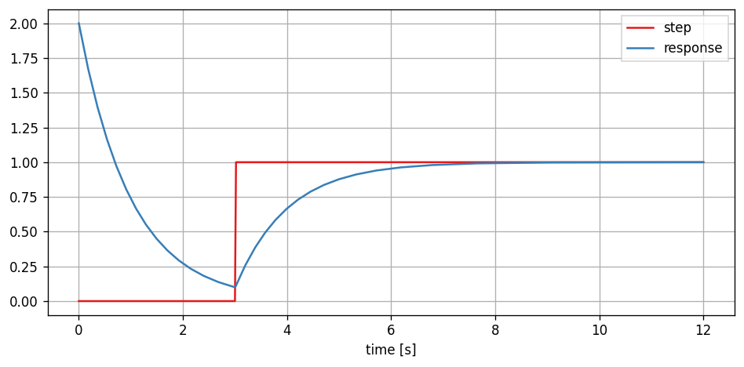
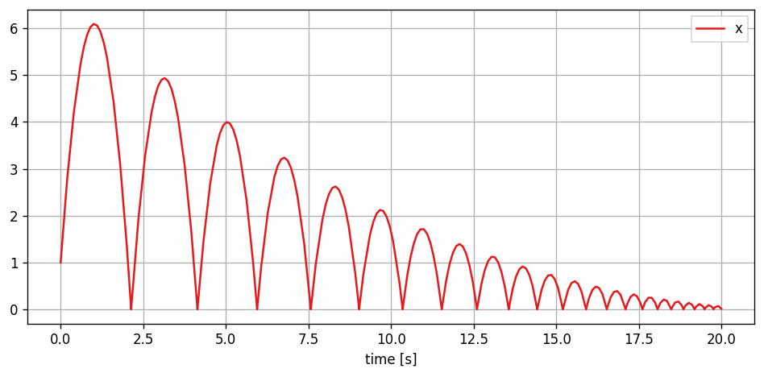
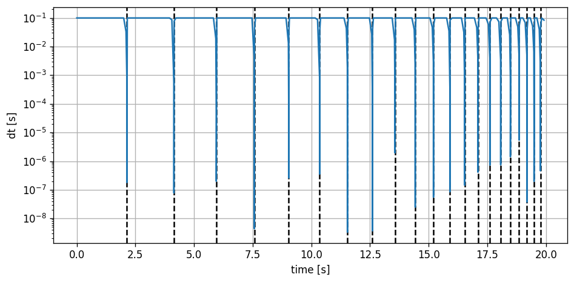

# PathSim: A Time-Domain System Simulation Framework

## Overview

PathSim is a flexible block-based time-domain system simulation framework in Python with automatic differentiation capabilities and an event handling mechanism. It provides a variety of classes that enable modeling and simulating complex interconnected dynamical systems similar to Matlab Simulink but in Python!

Key features of PathSim include:

- Hot-swappable blocks and solvers during simulation
- Natural handling of algebraic loops
- Blocks are inherently MIMO (Multiple Input, Multiple Output) capable
- Blocks are decentralized and manage their own state, i.e. reading from the scope is just `scope.read()`
- Linear scaling with the number of blocks and connections
- Wide range of numerical integrators (implicit, explicit, high order, adaptive)
- Modular and hierarchical modeling with (nested) subsystems
- Event handling system to detect and resolve discrete events (zero-crossing detection)
- Automatic differentiation for fully differentiable system simulations (sensitivity analysis and optimization)
- Library of pre-defined blocks (`Integrator`, `Adder`, `TransferFunction`, `Scope`, etc.)
- Extensibility by subclassing the base `Block` class and implementing just a handful of methods

For the full documentation, examples, tutorials and API-reference visit [readthedocs](https://pathsim.readthedocs.io/en/latest/)!

## Installation

The latest release version of pathsim is available on [PyPi](https://pypi.org/project/pathsim/) and installable via pip:

```console
pip install pathsim
```

## Example - Harmonic Oscillator

Here's an example that demonstrates how to create a basic simulation. The main components of the package are:

- `Simulation`: The main class that handles the blocks, connections, and the simulation loop.
- `Connection`: The class that defines the connections between blocks.
- Various block classes from the `blocks` module, such as `Integrator`, `Amplifier`, `Adder`, `Scope`, etc.

In this example, we create a simulation of the harmonic oscillator (a spring mass damper 2nd order system) initial value problem. The ODE that defines it is give by

$$
\ddot{x} + \frac{c}{m} \dot{x} + \frac{k}{m} x = 0
$$

where $c$ is the damping, $k$ the spring constant and $m$ the mass. And initial conditions $x_0$ and $v_0$ for position and velocity.

The ODE above can be translated to a block diagram using integrators, amplifiers and adders in the following way:


The topology of the block diagram above can be directly defined as blocks and connections in the `PathSim` framework. First we initialize the blocks needed to represent the dynamical systems with their respective arguments such as initial conditions and gain values, then the blocks are connected using `Connection` objects, forming two feedback loops. The `Simulation` instance manages the blocks and connections and advances the system in time with the timestep (`dt`). The `log` flag for logging the simulation progress is also set. Finally, we run the simulation for some number of seconds and plot the results using the `plot()` method of the scope block.


```python
from pathsim import Simulation
from pathsim import Connection
from pathsim.blocks import Integrator, Amplifier, Adder, Scope
from pathsim.solvers import SSPRK22  # 2nd order fixed timestep, this is also the default

#initial position and velocity
x0, v0 = 2, 5

#parameters (mass, damping, spring constant)
m, c, k = 0.8, 0.2, 1.5

# Create blocks 
I1 = Integrator(v0)   # integrator for velocity
I2 = Integrator(x0)   # integrator for position
A1 = Amplifier(-c/m)
A2 = Amplifier(-k/m)
P1 = Adder()
Sc = Scope(labels=["v(t)", "x(t)"])

blocks = [I1, I2, A1, A2, P1, Sc]

# Create connections
connections = [
    Connection(I1, I2, A1, Sc),   # one to many connection
    Connection(I2, A2, Sc[1]),
    Connection(A1, P1),           # default connection to port 0
    Connection(A2, P1[1]),        # specific connection to port 1
    Connection(P1, I1)
    ]

# Create a simulation instance from the blocks and connections
Sim = Simulation(blocks, connections, dt=0.05, log=True, Solver=SSPRK22)

# Run the simulation for 30 seconds
Sim.run(duration=30.0)

# Plot the results directly from the scope
Sc.plot()

# Read the results from the scope for further processing
time, data = Sc.read();
```

    2025-03-05 16:47:38,868 - INFO - LOGGING enabled
    2025-03-05 16:47:38,869 - INFO - SOLVER -> SSPRK22, adaptive=False, implicit=False
    2025-03-05 16:47:38,869 - INFO - ALGEBRAIC PATH LENGTH 2
    2025-03-05 16:47:38,870 - INFO - RESET, time -> 0.0
    2025-03-05 16:47:38,870 - INFO - TRANSIENT duration=30.0
    2025-03-05 16:47:38,870 - INFO - STARTING progress tracker
    2025-03-05 16:47:38,871 - INFO - progress=0%
    2025-03-05 16:47:38,875 - INFO - progress=10%
    2025-03-05 16:47:38,880 - INFO - progress=20%
    2025-03-05 16:47:38,885 - INFO - progress=30%
    2025-03-05 16:47:38,890 - INFO - progress=40%
    2025-03-05 16:47:38,895 - INFO - progress=50%
    2025-03-05 16:47:38,899 - INFO - progress=60%
    2025-03-05 16:47:38,904 - INFO - progress=70%
    2025-03-05 16:47:38,909 - INFO - progress=80%
    2025-03-05 16:47:38,913 - INFO - progress=90%
    2025-03-05 16:47:38,918 - INFO - progress=100%
    2025-03-05 16:47:38,919 - INFO - FINISHED, steps(total)=600(600), runtime=48.23ms
    


    

    


## Stiff Systems

PathSim implements a large variety of implicit integrators such as diagonally implicit runge-kutta (`DIRK2`, `ESDIRK43`, etc.) and multistep (`BDF2`, `GEAR52A`, etc.) methods. This enables the simulation of very stiff systems where the timestep is limited by stability and not accuracy of the method.

A common example for a stiff system is the Van der Pol oscillator where the parameter $\mu$ "controls" the severity of the stiffness. It is defined by the following second order ODE:

$$
\ddot{x} + \mu (1 - x^2) \dot{x} + x = 0
$$

Below, the Van der Pol system is built with two discrete `Integrator` blocks and a `Function` block. The parameter is set to $\mu = 1000$ which means severe stiffness. 


```python
from pathsim import Simulation, Connection
from pathsim.blocks import Integrator, Scope, Function

#implicit adaptive timestep solver 
from pathsim.solvers import ESDIRK54

#initial conditions
x1, x2 = 2, 0

#van der Pol parameter (1000 is very stiff)
mu = 1000

#blocks that define the system
Sc = Scope(labels=["$x_1(t)$"])
I1 = Integrator(x1)
I2 = Integrator(x2)
Fn = Function(lambda x1, x2: mu*(1 - x1**2)*x2 - x1)

blocks = [I1, I2, Fn, Sc]

#the connections between the blocks
connections = [
    Connection(I2, I1, Fn[1]), 
    Connection(I1, Fn, Sc), 
    Connection(Fn, I2)
    ]

#initialize simulation with the blocks, connections, timestep and logging enabled
Sim = Simulation(
    blocks, 
    connections, 
    dt=0.05, 
    log=True, 
    Solver=ESDIRK54, 
    tolerance_lte_abs=1e-6, 
    tolerance_lte_rel=1e-4
    )

#run simulation for some number of seconds
Sim.run(3*mu)

#plot the results directly (steps highlighted)
Sc.plot(".-");
```

    2025-03-05 16:47:41,530 - INFO - LOGGING enabled
    2025-03-05 16:47:41,530 - INFO - SOLVER -> ESDIRK54, adaptive=True, implicit=True
    2025-03-05 16:47:41,531 - INFO - ALGEBRAIC PATH LENGTH 1
    2025-03-05 16:47:41,532 - INFO - RESET, time -> 0.0
    2025-03-05 16:47:41,532 - INFO - TRANSIENT duration=3000
    2025-03-05 16:47:41,533 - INFO - STARTING progress tracker
    2025-03-05 16:47:41,540 - INFO - progress=0%
    2025-03-05 16:47:41,688 - INFO - progress=11%
    2025-03-05 16:47:41,739 - INFO - progress=20%
    2025-03-05 16:47:42,724 - INFO - progress=33%
    2025-03-05 16:47:42,760 - INFO - progress=43%
    2025-03-05 16:47:42,833 - INFO - progress=50%
    2025-03-05 16:47:44,009 - INFO - progress=62%
    2025-03-05 16:47:44,079 - INFO - progress=71%
    2025-03-05 16:47:44,397 - INFO - progress=80%
    2025-03-05 16:47:45,178 - INFO - progress=93%
    2025-03-05 16:47:45,224 - INFO - progress=100%
    2025-03-05 16:47:45,224 - INFO - FINISHED, steps(total)=292(468), runtime=3691.04ms
    


    

    


## Differentiable Simulation

PathSim also includes a fully fledged automatic differentiation framework based on a dual number system with overloaded operators and numpy ufunc integration. This makes the system simulation fully differentiable end-to-end with respect to a predefined set of parameters. Works with all integrators, adaptive, fixed, implicit, explicit. 

To demonstrate this lets consider the following linear feedback system and perform a sensitivity analysis on it with respect to some system parameters. 


The source term is a scaled unit step function (scaled by $b$). In this example, the parameters for the sensitivity analysis are the feedback term $a$, the initial condition $x_0$ and the amplitude of the source term $b$.


```python
from pathsim import Simulation, Connection
from pathsim.blocks import Source, Integrator, Amplifier, Adder, Scope

#AD module
from pathsim.optim import Value, der

#values for derivative propagation / parameters for sensitivity analysis
a  = Value(-1)
b  = Value(1)
x0 = Value(2)

#simulation timestep
dt = 0.01

#step function
tau = 3
def s(t):
    return b*int(t>tau)

#blocks that define the system
Src = Source(s)
Int = Integrator(x0)
Amp = Amplifier(a)
Add = Adder()
Sco = Scope(labels=["step", "response"])

blocks = [Src, Int, Amp, Add, Sco]

#the connections between the blocks
connections = [
    Connection(Src, Add[0], Sco[0]),
    Connection(Amp, Add[1]),
    Connection(Add, Int),
    Connection(Int, Amp, Sco[1])
    ]

#initialize simulation with the blocks, connections, timestep and logging enabled
Sim = Simulation(blocks, connections, dt=dt, log=True)
    
#run the simulation for some time
Sim.run(4*tau)

Sco.plot()
```

    2025-03-05 16:47:50,982 - INFO - LOGGING enabled
    2025-03-05 16:47:50,983 - INFO - SOLVER -> SSPRK22, adaptive=False, implicit=False
    2025-03-05 16:47:50,983 - INFO - ALGEBRAIC PATH LENGTH 2
    2025-03-05 16:47:50,983 - INFO - RESET, time -> 0.0
    2025-03-05 16:47:50,984 - INFO - TRANSIENT duration=12
    2025-03-05 16:47:50,984 - INFO - STARTING progress tracker
    2025-03-05 16:47:50,985 - INFO - progress=0%
    2025-03-05 16:47:51,006 - INFO - progress=10%
    2025-03-05 16:47:51,026 - INFO - progress=20%
    2025-03-05 16:47:51,046 - INFO - progress=30%
    2025-03-05 16:47:51,065 - INFO - progress=40%
    2025-03-05 16:47:51,084 - INFO - progress=50%
    2025-03-05 16:47:51,104 - INFO - progress=60%
    2025-03-05 16:47:51,124 - INFO - progress=70%
    2025-03-05 16:47:51,144 - INFO - progress=80%
    2025-03-05 16:47:51,164 - INFO - progress=90%
    2025-03-05 16:47:51,184 - INFO - progress=100%
    2025-03-05 16:47:51,184 - INFO - FINISHED, steps(total)=1201(1201), runtime=199.73ms
    


    

    


Now the recorded time series data is of type `Value` and we can evaluate the automatically computed partial derivatives at each timestep. For example the response, differentiated with respect to the linear feedback parameter $\partial x(t) / \partial a$ can be extracted from the data like this `der(data, a)`.


```python
import matplotlib.pyplot as plt

#read data from the scope
time, [step, data] = Sco.read()

fig, ax = plt.subplots(nrows=1, tight_layout=True, figsize=(8, 4), dpi=120)

#evaluate and plot partial derivatives
ax.plot(time, der(data, a), label=r"$\partial x / \partial a$")
ax.plot(time, der(data, x0), label=r"$\partial x / \partial x_0$")
ax.plot(time, der(data, b), label=r"$\partial x / \partial b$")

ax.set_xlabel("time [s]")
ax.grid(True)
ax.legend(fancybox=False);
```


    

    


## Event Detection

PathSim has an event handling system that monitors the simulation state and can find and locate discrete events by  trigger callbacks or state transformations.

This enables the simulation of hybrid continuous time systems with discrete events. Probably the most popular example for this is the bouncing ball where discrete events occur whenever the ball touches the floor. The event in this case is a zero-crossing.


```python
from pathsim import Simulation, Connection
from pathsim.blocks import Integrator, Constant, Scope
from pathsim.solvers import RKBS32

#event library
from pathsim.events import ZeroCrossing

#initial values
x0, v0 = 1, 10

#blocks that define the system
Ix = Integrator(x0)     # v -> x
Iv = Integrator(v0)     # a -> v 
Cn = Constant(-9.81)    # gravitational acceleration
Sc = Scope(labels=["x", "v"])

blocks = [Ix, Iv, Cn, Sc]

#the connections between the blocks
connections = [
    Connection(Cn, Iv),
    Connection(Iv, Ix),
    Connection(Ix, Sc)
    ]

#event function for zero crossing detection
def func_evt(t):
    i, o, s = Ix() #get block inputs, outputs and states
    return s

#action function for state transformation
def func_act(t):
    i1, o1, s1 = Ix() 
    i2, o2, s2 = Iv() 
    Ix.engine.set(abs(s1))
    Iv.engine.set(-0.9*s2)

#event (zero-crossing) -> ball makes contact
E1 = ZeroCrossing(
    func_evt=func_evt,                 
    func_act=func_act, 
    tolerance=1e-4
    )

events = [E1]

#initialize simulation with the blocks, connections, timestep and logging enabled
Sim = Simulation(
    blocks, 
    connections, 
    events, 
    dt=0.1, 
    log=True, 
    Solver=RKBS32, 
    dt_max=0.1
    )

#run the simulation
Sim.run(20)

#plot the recordings from the scope
Sc.plot();
```

    2025-02-19 17:19:54,853 - INFO - LOGGING enabled
    2025-02-19 17:19:54,854 - INFO - SOLVER -> RKBS32, adaptive=True, implicit=False
    2025-02-19 17:19:54,854 - INFO - ALGEBRAIC PATH LENGTH 1
    2025-02-19 17:19:54,855 - INFO - RESET, time -> 0.0
    2025-02-19 17:19:54,855 - INFO - TRANSIENT duration=20
    2025-02-19 17:19:54,856 - INFO - STARTING progress tracker
    2025-02-19 17:19:54,856 - INFO - progress=0%
    2025-02-19 17:19:54,859 - INFO - progress=10%
    2025-02-19 17:19:54,863 - INFO - progress=20%
    2025-02-19 17:19:54,869 - INFO - progress=30%
    2025-02-19 17:19:54,873 - INFO - progress=40%
    2025-02-19 17:19:54,877 - INFO - progress=50%
    2025-02-19 17:19:54,883 - INFO - progress=60%
    2025-02-19 17:19:54,889 - INFO - progress=70%
    2025-02-19 17:19:54,897 - INFO - progress=80%
    2025-02-19 17:19:54,904 - INFO - progress=90%
    2025-02-19 17:19:54,917 - INFO - progress=100%
    2025-02-19 17:19:54,918 - INFO - FINISHED, steps(total)=395(496), runtime=62.44ms
    


    

    


During the event handling, the simulator approaches the event until the event tolerance is met. You can see this by analyzing the timesteps taken by the adaptive integrator `RKBS32`.


```python
import numpy as np
import matplotlib.pyplot as plt

fig, ax = plt.subplots(figsize=(8,4), tight_layout=True, dpi=120)

time, _ = Sc.read()

#add detected events
for t in E1: ax.axvline(t, ls="--", c="k")

#plot the timesteps
ax.plot(time[:-1], np.diff(time))

ax.set_yscale("log")
ax.set_ylabel("dt [s]")
ax.set_xlabel("time [s]")
ax.grid(True)
```


    

    


## Citation

In case you found this package to be useful in your research, please consider citing.

```
@misc{pathsim,
    author={Rother, Milan},
    title={PathSim: A Time-Domain System Simulation Framework},
    year={2024},
    url={https://github.com/milanofthe/pathsim},
}
```

## Contributing and Future

There are some things I want to explore with PathSim eventually, and your help is highly appreciated! If you want to contribute, send me a message and we can discuss how!

Some of the possible directions for future features are:
- explore block level parallelization (fork-join) with Python 3.13 free-threading, batching based on execution cost
- linearization of blocks and subsystems with the AD framework, linear surrogate models, system wide linearization
- improved / more robust steady state solver and algebraic loop solver
- methods for periodic steady state analysis
- more extensive testing and validation (as always)


```python

```
