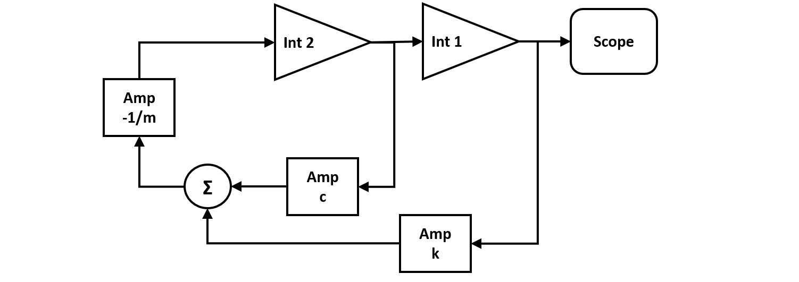
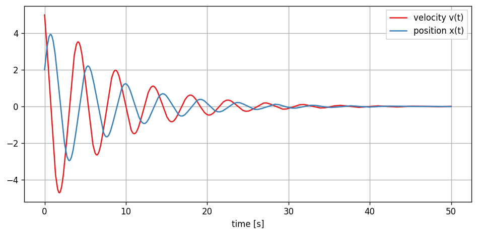
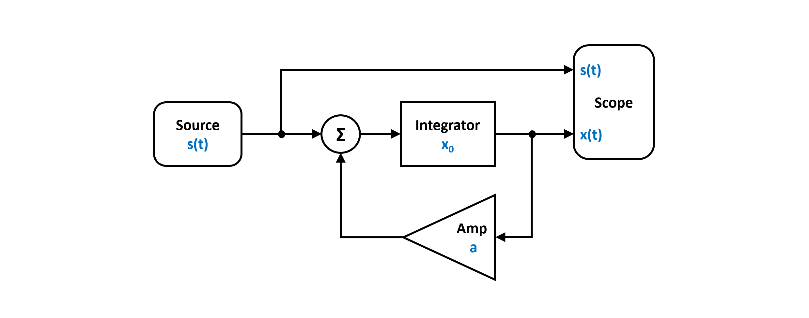
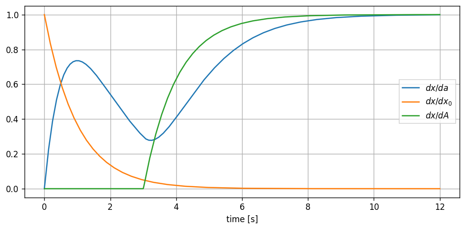

# PathSim: A Time-Domain System Simulation Framework


## Overview

PathSim is a minimalistic and flexible block-based time-domain system simulation framework in Python with basic automatic differentiation capabilities. It provides a modular and intuitive approach to modeling and simulating complex interconnected dynamical systems. It is similar to Matlab Simulink in spirit but works very differently under the hood.

Key features of PathSim include:

- Decentralized architecture where each dynamical block has their own numerical integration engine.
- The system is solved directly on the computational graph instead of compiling a unified differential algebraic system.
- This has some advantages such as hot-swappable blocks during simulation and reading simulation results directly from the scopes.
- The block execution is decoupled from the data transfer, which enables parallelization (future) and linear computational complexity scaling for sparsely connected systems.
- Support for MIMO (Multiple Input, Multiple Output) blocks, enabling the creation of complex interconnected system topologies.
- Fixed-point iteration approach with path length estimation to efficiently resolve algebraic loops.
- Wide range of numerical solvers, including implicit and explicit multi-stage, and adaptive Runge-Kutta methods such as `RKDP54` or `ESDIRK54`.
- Modular and hierarchical modeling with (nested) subsystems.
- Automatic differentiation for differentiable system simulations.
- Library of pre-defined blocks, including mathematical operations, integrators, delays, transfer functions, and more.
- Easy extensibility, allowing users to define custom blocks by subclassing the base `Block` class and implementing just a handful of methods.

## Installation

The latest release version of pathsim is installable via pip:

```console
$ pip install pathsim
```

## Example - Harmonic Oscillator

Here's an example that demonstrates how to create a basic simulation. The main components of the package are:

- `Simulation`: The main class that handles the blocks, connections, and the simulation loop.
- `Connection`: The class that defines the connections between blocks.
- Various block classes from the `blocks` module, such as `Integrator`, `Amplifier`, `Adder`, `Scope`, etc.

In this example, we create a simulation of the harmonic oscillator (a spring mass damper 2nd order system) initial value problem. The ODE that defines it is give by

$$
\ddot{x} + \frac{c}{m} \dot{x} + \frac{k}{m} x = 0
$$

where $c$ is the damping, $k$ the spring constant and $m$ the mass. And initial conditions $x_0$ and $v_0$ for position and velocity.

The ODE above can be translated to a block diagram using integrators, amplifiers and adders in the following way:



The topology of the block diagram above can be directly defined as blocks and connections in the `PathSim` framework. First we initialize the blocks needed to represent the dynamical systems with their respective arguments such as initial conditions and gain values, then the blocks are connected using `Connection` objects, forming two feedback loops. The `Simulation` instance manages the blocks and connections and advances the system in time with the timestep (`dt`). The `log` flag for logging the simulation progress is also set. Finally, we run the simulation for some number of seconds and plot the results using the `plot()` method of the scope block.


```python
from pathsim import Simulation
from pathsim import Connection
from pathsim.blocks import Integrator, Amplifier, Adder, Scope
from pathsim.solvers import SSPRK22  # 2nd order fixed timestep, this is also the default

#initial position and velocity
x0, v0 = 2, 5

#parameters (mass, damping, spring constant)
m, c, k = 0.8, 0.2, 1.5

# Create blocks 
I1 = Integrator(v0)   # integrator for velocity
I2 = Integrator(x0)   # integrator for position
A1 = Amplifier(-c/m)
A2 = Amplifier(-k/m)
P1 = Adder()
Sc = Scope(labels=["v(t)", "x(t)"])

blocks = [I1, I2, A1, A2, P1, Sc]

# Create connections
connections = [
    Connection(I1, I2, A1, Sc),   # one to many connection
    Connection(I2, A2, Sc[1]),
    Connection(A1, P1),           # default connection to port 0
    Connection(A2, P1[1]),        # specific connection to port 1
    Connection(P1, I1)
    ]

# Create a simulation instance from the blocks and connections
Sim = Simulation(blocks, connections, dt=0.05, log=True, Solver=SSPRK22)

# Run the simulation for 50 seconds
Sim.run(duration=50.0)

# Plot the results directly from the scope
Sc.plot()

# Read the results from the scope for further processing
time, data = Sc.read()
```

    2024-10-23 15:38:58,943 - INFO - LOGGING enabled
    2024-10-23 15:38:58,943 - INFO - SOLVER SSPRK22 adaptive=False implicit=False
    2024-10-23 15:38:58,944 - INFO - PATH LENGTH ESTIMATE 2, 'iterations_min' set to 2
    2024-10-23 15:38:58,944 - INFO - RESET
    2024-10-23 15:38:58,944 - INFO - RUN duration=50.0
    2024-10-23 15:38:58,945 - INFO - STARTING progress tracker
    2024-10-23 15:38:58,945 - INFO - progress=0%
    2024-10-23 15:38:58,963 - INFO - progress=10%
    2024-10-23 15:38:58,982 - INFO - progress=20%
    2024-10-23 15:38:59,000 - INFO - progress=30%
    2024-10-23 15:38:59,019 - INFO - progress=40%
    2024-10-23 15:38:59,037 - INFO - progress=50%
    2024-10-23 15:38:59,055 - INFO - progress=60%
    2024-10-23 15:38:59,073 - INFO - progress=70%
    2024-10-23 15:38:59,092 - INFO - progress=80%
    2024-10-23 15:38:59,110 - INFO - progress=90%
    2024-10-23 15:38:59,129 - INFO - progress=100%
    2024-10-23 15:38:59,129 - INFO - FINISHED steps(total)=1001(1001) runtime=184.78ms
    


    

    


## Example - Differentiable Simulation

PathSim also includes a rudimentary automatic differentiation framework based on a dual number system with overloaded operators. This makes the system simulation fully differentiable with respect to a predefined set of parameters. For now it only works with the explicit integrators. To demonstrate this lets consider the following linear feedback system.




The source term is a scaled unit step function (scaled by $A$). The parameters we want to differentiate the time domain response by are the feedback term $a$, the initial condition $x_0$ and the amplitude of the source term $A$.


```python
from pathsim import Simulation, Connection
from pathsim.blocks import Source, Integrator, Amplifier, Adder, Scope

#AD module
from pathsim.diff import Parameter

#parameters
A  = Parameter(1)
a  = Parameter(-1)
x0 = Parameter(2)

#simulation timestep
dt = 0.01

#step function
tau = 3
def s(t):
    return A*int(t>tau)

#blocks that define the system
Src = Source(s)
Int = Integrator(x0)
Amp = Amplifier(a)
Add = Adder()
Sco = Scope(labels=["step", "response"])

blocks = [Src, Int, Amp, Add, Sco]

#the connections between the blocks
connections = [
    Connection(Src, Add[0], Sco[0]),
    Connection(Amp, Add[1]),
    Connection(Add, Int),
    Connection(Int, Amp, Sco[1])
    ]

#initialize simulation with the blocks, connections, timestep and logging enabled
Sim = Simulation(blocks, connections, dt=dt, log=True)
    
#run the simulation for some time
Sim.run(4*tau)

Sco.plot()
```

    2024-10-23 15:39:02,206 - INFO - LOGGING enabled
    2024-10-23 15:39:02,207 - INFO - SOLVER SSPRK22 adaptive=False implicit=False
    2024-10-23 15:39:02,207 - INFO - PATH LENGTH ESTIMATE 2, 'iterations_min' set to 2
    2024-10-23 15:39:02,208 - INFO - RESET
    2024-10-23 15:39:02,209 - INFO - RUN duration=12
    2024-10-23 15:39:02,209 - INFO - STARTING progress tracker
    2024-10-23 15:39:02,210 - INFO - progress=0%
    2024-10-23 15:39:02,263 - INFO - progress=10%
    2024-10-23 15:39:02,316 - INFO - progress=20%
    2024-10-23 15:39:02,368 - INFO - progress=30%
    2024-10-23 15:39:02,420 - INFO - progress=40%
    2024-10-23 15:39:02,471 - INFO - progress=50%
    2024-10-23 15:39:02,523 - INFO - progress=60%
    2024-10-23 15:39:02,575 - INFO - progress=70%
    2024-10-23 15:39:02,627 - INFO - progress=80%
    2024-10-23 15:39:02,678 - INFO - progress=90%
    2024-10-23 15:39:02,730 - INFO - progress=100%
    2024-10-23 15:39:02,731 - INFO - FINISHED steps(total)=1201(1201) runtime=520.65ms
    


    

    


Now the recorded data is of type `Parameter` and we can evaluate the automatically computed partial derivatives at each timestep. For example 
$\partial x(t) / \partial a$ the response with respect to the linear feedback parameter.


```python
import matplotlib.pyplot as plt

#read data from the scope
time, [step, data] = Sco.read()

#evaluate partial derivatives
dxda = list(map(lambda x: x.d(a), data))    # w.r.t. feedback
dxdx0 = list(map(lambda x: x.d(x0), data))  # w.r.t. initial condition
dxdA = list(map(lambda x: x.d(A), data))    # w.r.t. source amplitude

fig, ax = plt.subplots(nrows=1, tight_layout=True, figsize=(8, 4), dpi=120)

ax.plot(time, dxda, label="$dx/da$")
ax.plot(time, dxdx0, label="$dx/dx_0$")
ax.plot(time, dxdA, label="$dx/dA$")

ax.set_xlabel("time [s]")
ax.grid(True)
ax.legend(fancybox=False);
```


    

    


## More Examples
There are many examples of dynamical system simulations in the `examples` directory. They cover almost all the blocks currently available in `PathSim` as well as different numerical integrators / solvers to experiment with.


```python

```
