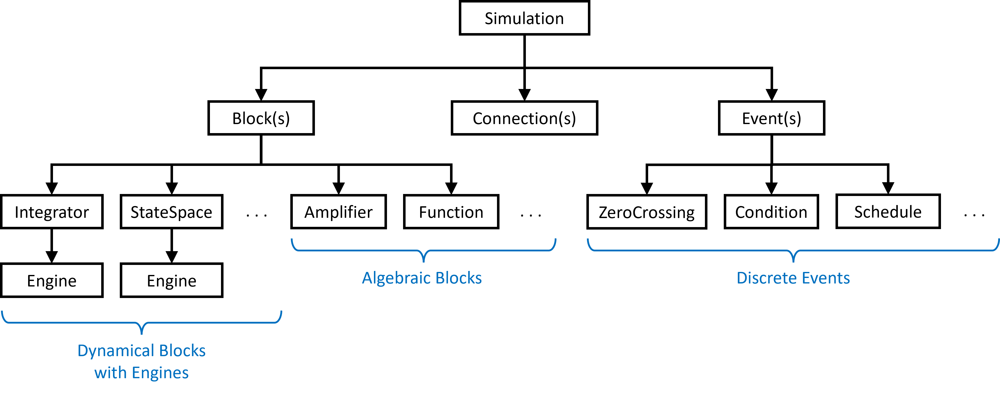
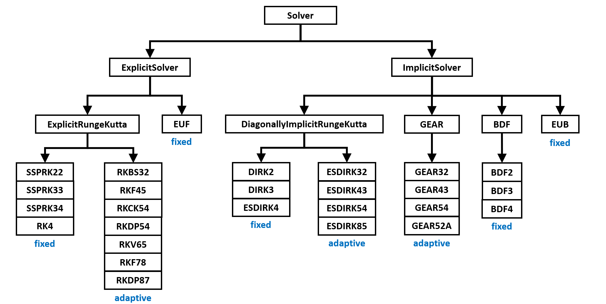

API Reference
=============

The basic object hierarchy of PathSim is shown in the diagramm below.

System Definition and Simulation
--------------------------------

The following modules serve the system definition and simulation.

.. toctree::
   :maxdepth: 3
   :caption: Simulation

   modules/pathsim.simulation
   
.. toctree::
   :maxdepth: 3
   :caption: Subsystem

   modules/pathsim.subsystem
   
.. toctree::
   :maxdepth: 3
   :caption: Connections

   modules/pathsim.connection
   
.. toctree::
   :maxdepth: 5
   :caption: Blocks

   modules/pathsim.blocks

.. toctree::
   :maxdepth: 5
   :caption: Events

   modules/pathsim.events

ODE Solvers
-----------

The numerical ODE solvers, available in PathSim are structured like this:

.. toctree::
   :maxdepth: 4
   :caption: Solvers

   modules/pathsim.solvers

Optimizers and Automatic Differentiation
----------------------------------------

The `pathsim.optim` module contains a range of nonlinear solvers / optimizers that are primarily used for the implicit update equation of implicit ODE solvers and for the steadystate solver. This module also includes the automatic differentiation framework.

.. toctree::
   :maxdepth: 4
   :caption: Optim

   modules/pathsim.optim

Utilities
---------

Utility functions and classes.

.. toctree::
   :maxdepth: 4
   :caption: Utils

   modules/pathsim.utils
