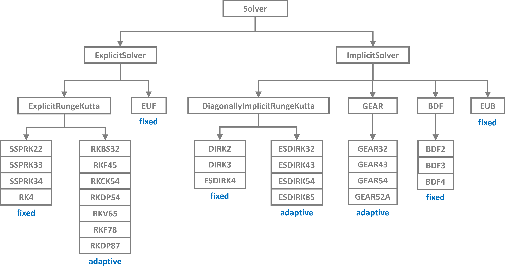

API Reference
=============

----

Core Components
---------------

The following modules form the core of PathSim's system definition and simulation capabilities.

.. grid:: 2
   :gutter: 3

   .. grid-item-card:: 🎯 Simulation
      :link: modules/pathsim.simulation
      :link-type: doc

      Main simulation engine that orchestrates system execution, manages blocks, connections, and events.

   .. grid-item-card:: 🔌 Connection
      :link: modules/pathsim.connection
      :link-type: doc

      Defines signal flow between blocks, enabling data transfer and system interconnection.

   .. grid-item-card:: 📦 Subsystem
      :link: modules/pathsim.subsystem
      :link-type: doc

      Enables hierarchical modeling by encapsulating blocks and connections into reusable components.

   .. grid-item-card:: 🧱 Block Library
      :link: modules/pathsim.blocks
      :link-type: doc

      Comprehensive library of pre-built blocks for sources, operations, controllers, and more.

.. toctree::
   :hidden:
   :maxdepth: 3

   modules/pathsim.simulation
   modules/pathsim.subsystem
   modules/pathsim.connection
   modules/pathsim.blocks

----

Event System
------------

PathSim's event handling mechanism enables discrete event detection and system state modifications.

.. grid:: 1
   :gutter: 3

   .. grid-item-card:: ⚡ Event Library
      :link: modules/pathsim.events
      :link-type: doc

      Zero-crossing detection, scheduled events, and condition-based triggers for hybrid system simulation.

.. toctree::
   :hidden:
   :maxdepth: 5

   modules/pathsim.events

----

Numerical Solvers
-----------------

PathSim provides a wide range of ODE solvers with different characteristics and performance profiles.

.. grid:: 1
   :gutter: 3

   .. grid-item-card:: 🔢 Solver Library
      :link: modules/pathsim.solvers
      :link-type: doc

      Explicit and implicit Runge-Kutta methods, BDF, Gear, and adaptive solvers for stiff and non-stiff problems.

.. toctree::
   :hidden:
   :maxdepth: 4

   modules/pathsim.solvers

----

Optimization & Differentiation
------------------------------

Advanced features for optimization and nonlinear solving.

.. grid:: 1
   :gutter: 3

   .. grid-item-card:: 🎓 Optimization Module
      :link: modules/pathsim.optim
      :link-type: doc

      Nonlinear solvers and optimizers.

.. toctree::
   :hidden:
   :maxdepth: 4

   modules/pathsim.optim

----

Utilities
---------

Helper functions and utility classes for analysis, plotting, and system management.

.. grid:: 1
   :gutter: 3

   .. grid-item-card:: 🛠️ Utility Functions
      :link: modules/pathsim.utils
      :link-type: doc

      Analysis tools, real-time plotting, serialization, adaptive buffers, and more.

.. toctree::
   :hidden:
   :maxdepth: 4

   modules/pathsim.utils
