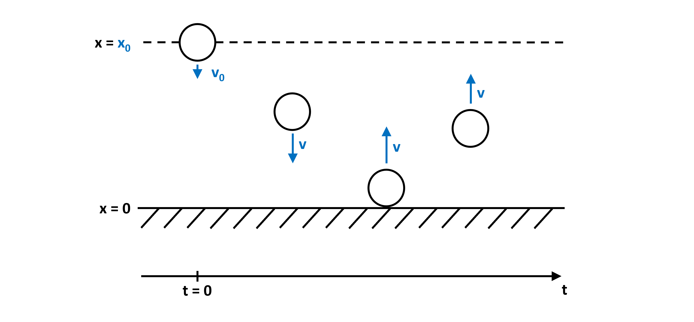
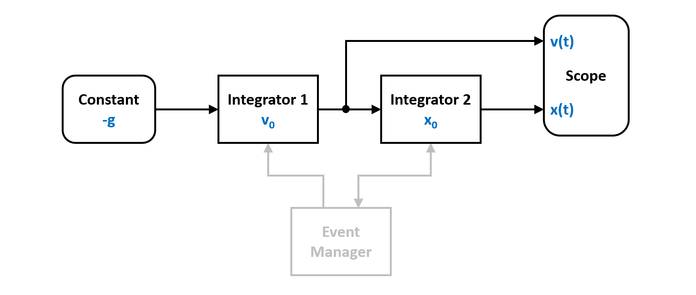
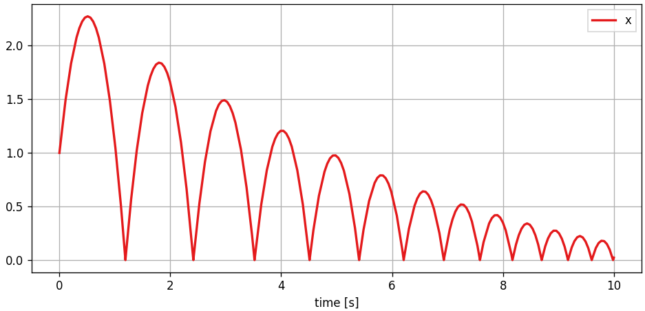
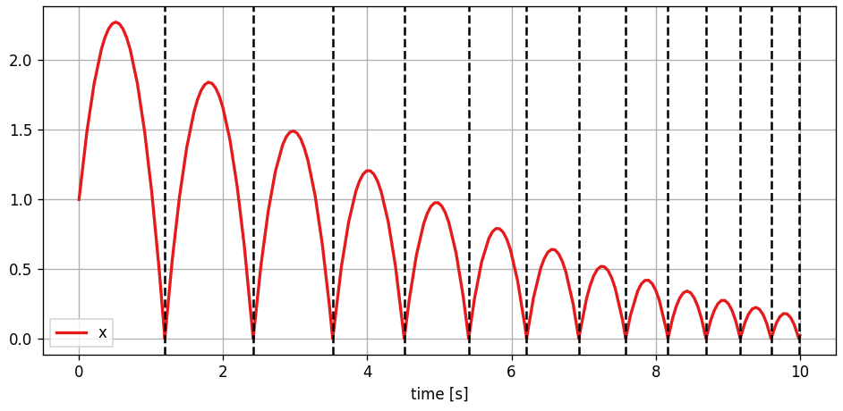
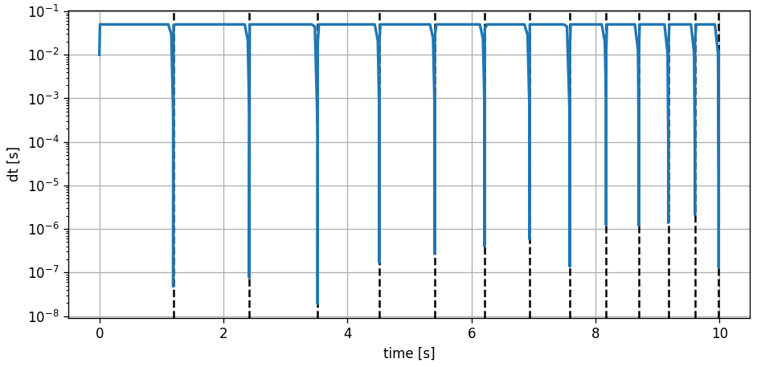

.. _ref-bouncing-ball:

Bouncing Ball
-------------

This example demonstrates `PathSims` event handling system. The classical example here is the bouncing ball. The ball accelerates downward due to gravity and one it hits the floor, it bounces back. The dynamics of this system are discontinuous due to the jump in velocity (sign change) exactly at the bounce. This is called a discrete event, specifically a zero crossing event. 

You can also find this example as a single file in the `GitHub repository <https://github.com/milanofthe/pathsim/blob/master/examples/examples_event/example_bouncingball.py>`_.

Systems like this require the location and resolution of discrete events within the timestep and are not easily solved with standard numerical ODE solvers. `PathSim` implements an event management system that can track the system state and locate and resolve specified events. 

We can translate the dynamics of the system into a block diagram. Note the event manager that watches the state of the integrator for the position and can act on both integrator states:

To simulate the bouncing ball, lets start by importing the required blocks from block library. In this case integrators and a constant for gravity. And of course the :class:`.ZeroCrossing` event manager from the event library.

.. code-block:: python

    from pathsim import Simulation, Connection
    from pathsim.blocks import Integrator, Constant, Scope

    from pathsim.events import ZeroCrossing

Then define the system parameters and the initial conditions (position and velocity):

.. code-block:: python

    #gravitational acceleration
    g = 9.81

    #elasticity of bounce
    b = 0.9

    #initial conditions
    x0, v0 = 1, 5

Now the system definition. We need two integrators, one for integrating the gravitational acceleration to get the velocity and another one to get the position from there. And of course a constant that defines the gravitational acceleration.

.. code-block:: python

    #blocks that define the system
    Ix = Integrator(x0)     # v -> x
    Iv = Integrator(v0)     # a -> v 
    Cn = Constant(-g)       # gravitational acceleration
    Sc = Scope(labels=["x", "v"])

    blocks = [Ix, Iv, Cn, Sc]

    #the connections between the blocks
    connections = [
        Connection(Cn, Iv),
        Connection(Iv, Ix),
        Connection(Ix, Sc[0])
        ]

Now the continuous system dynamics are defined. Without any additions, the ball would just accelerate indefinitely even past the floor. To implement the bounce, we need to define a zero crossing event tracker, that watches the position and can detect when it changes its sign.

In `PathSim` events are defined by their type and an event function that is evaluated to determine whether an event has occured and how close to the timestep it is and an action function that gets called to resolve the event once it is located to sufficient accuracy.

Here the event function just watches the state of the integrator `Ix`, i.e. the position and if it crosses the origin, the action function flips the sign of the velocity, i.e. the state of integrator `Iy` multiplied by the elasticity constant (looses some energy at the bounce): 

.. code-block:: python

    #event function for zero crossing detection
    def func_evt(t):
        *_, x = Ix() #get block outputs and states
        return x

    #action function for state transformation
    def func_act(t):
        *_, x = Ix()
        *_, v = Iv()
        Ix.engine.set(abs(x))
        Iv.engine.set(-b*v)

    #events (zero crossing)
    E1 = ZeroCrossing(
        func_evt=func_evt,                 
        func_act=func_act, 
        tolerance=1e-4
        )

    events = [E1]

Now the hybrid dynamical system consisting of the blocks, connections and discrete events is fully defined. Next, we can initialize the simulation and set some tolerances. We use an adaptive timestep ODE solver :class:`.RKBS32` (its essentially the same as Matlabs `ode23`) so the event managemant system can use backtracking to accurately locate the events. Finally we can run the simulation for some duration.

.. code-block:: python
    
    #import the adaptive timestep ODE solver
    from pathsim.solvers import RKBS32
             
    #initialize simulation
    Sim = Simulation(
        blocks, 
        connections, 
        events, 
        dt=0.01, 
        dt_max=0.04,
        log=True, 
        Solver=RKBS32, 
        tolerance_lte_rel=1e-5, 
        tolerance_lte_abs=1e-7
        )

    #run the simulation
    Sim.run(10)

Due to the object oriented and decentralized architecture of `PathSim`, the scope block holds the time series data directly. Reading the recorded data is as easy as

.. code-block:: python

    #read the recordings from the scope direclty
    time, [data_x] = Sc.read()

and plotting the results in an external matplotlib window is also straight forward

.. code-block:: python

    #plot the recordings from the scope
    Sc.plot("-", lw=2)

and looks like this:

We can also add the detected events to the plot by just iterating the event instance

.. code-block:: python
    
    #add detected events to scope plot
    for t in E1: 
        Sc.ax.axvline(t, ls="--", c="k")

which looks like this:

For educational purposes it might be interesting to have a look at the evolution of the timestep.

.. code-block:: python
    
    fig, ax = plt.subplots(figsize=(8,4), tight_layout=True, dpi=120)

    #add the events
    for t in E1: 
        ax.axvline(t, ls="--", c="k")

    #plot the differences of time -> timesteps
    ax.plot(time[:-1], np.diff(time), lw=2)

    ax.set_yscale("log")
    ax.set_ylabel("dt [s]")
    ax.set_xlabel("time [s]")
    ax.grid(True)

We can clearly see how the adaptive integrator in combination with the event handling system approaches the event location with smaller steps and once located takes larger steps again until the next event is in sight. And so on.

