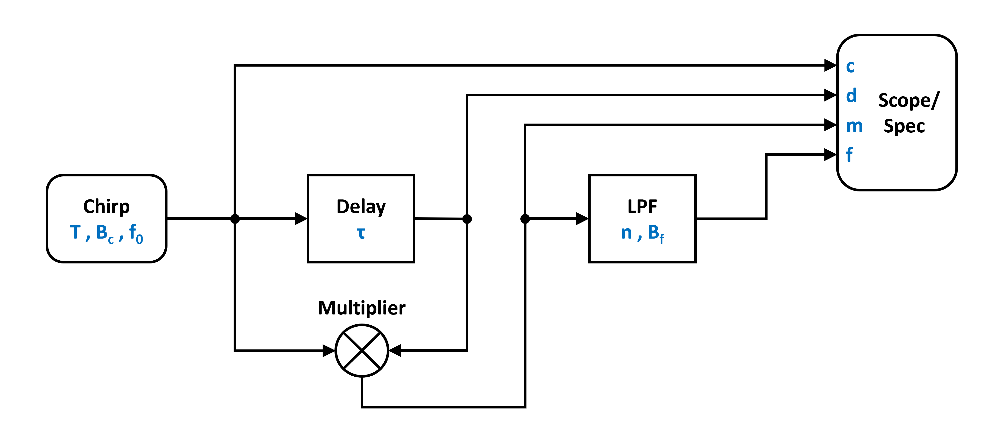
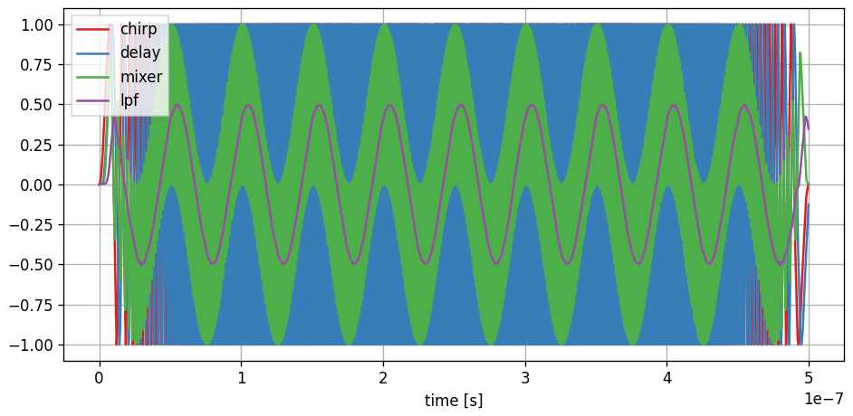
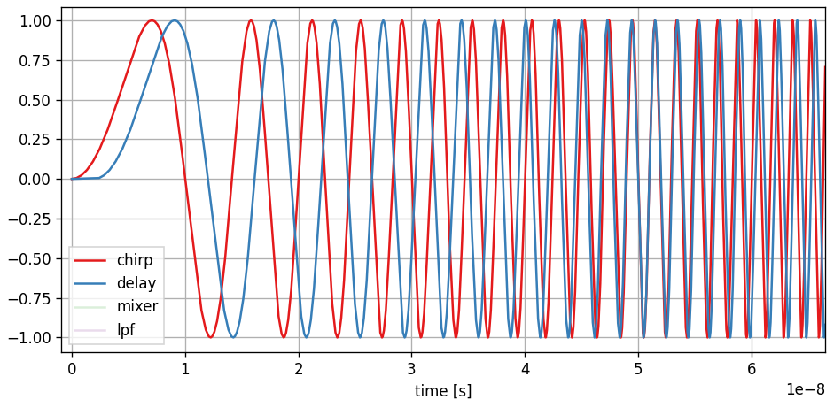
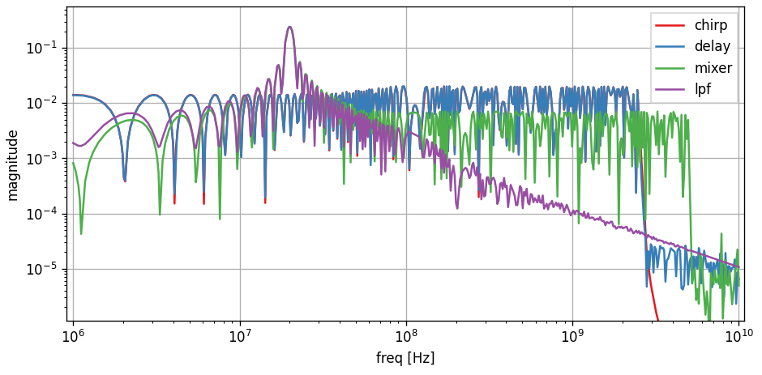
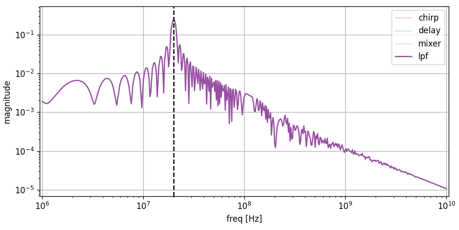

FMCW Radar
----------

In this example we simulate a simple frequency modulated continuous wave (FMCW) radar system. 

You can also find this example as a single file in the `GitHub repository <https://github.com/milanofthe/pathsim/blob/master/examples/examples_rf/example_radar.py>`_.

Below we have a very simplistic image of a radar system, it consists of a signal generator, transmitter/reciever chain and directed antennas. The fundamental working principle of a FMCW radar is that if we multiply a chirp signal (linearly frequency modulated sinusoid) with a delayed version of itself, we get a signal that has at each time two frequency components (sum and diffrerence). The low frequency component then is directly proportional to the phase shift between the two signals and this the time delay. This can be used to reconstruct the target distance from the frequency domain spectrum. 

The figure below shows the block diagram of a very basic FMCW radar system consisting of a chirp source (sinusoid with a linearly time dependent frequency), a delay (to model the signal propagation), a multiplier (to model a mixer), a low pass filter and of course blocks for time series and frequency domain data recording.

Lets start by importing the requred classes from `PathSim`:

.. code-block:: python

    from pathsim import Simulation, Connection

    #from the block library
    from pathsim.blocks import Multiplier, Scope, Adder, Spectrum, Delay, ChirpSource, ButterworthLowpassFilter

Now lets define the system parameters starting with the :class:`.ChirpSource`, which is defined by the starting frequency, the bandwith and the ramp duration. 

.. code-block:: python

    #natural constants (approximately)
    c0 = 3e8  

    #chirp parameters
    B, T, f_min = 5e9, 5e-7, 1e9

    #delay for target emulation
    tau = 2e-9

    #for reference, the expected target distance
    R = c0 * tau / 2

    #and the corresponding frequency
    f_trg = 2 * R * B / (T * c0)

Next we can build the system by defining the blocks and their connections:

.. code-block:: python

    Src = ChirpSource(f0=f_min, BW=B, T=T)
    Add = Adder()
    Dly = Delay(tau)
    Mul = Multiplier()
    Lpf = ButterworthLowpassFilter(f_trg*3, n=2)
    Spc = Spectrum(
        freq=np.logspace(6, 10, 500), 
        labels=["chirp", "delay", "mixer", "lpf"]
        )
    Sco = Scope(
        labels=["chirp", "delay", "mixer", "lpf"]
        )

    #collecting the blocks in a list
    blocks = [Src, Add,  Dly, Mul, Lpf, Spc, Sco]

    #connections between the blocks
    connections = [
        Connection(Src, Add[0]),
        Connection(Add, Dly, Mul, Sco, Spc),
        Connection(Dly, Mul[1], Sco[1], Spc[1]),
        Connection(Mul, Lpf, Sco[2], Spc[2]),
        Connection(Lpf, Sco[3], Spc[3])
    ]

Now we are ready to initialize the simulation and run it for some time. Here it makes sense to run it for the duration of one chirp period:

.. code-block:: python

    #initialize simulation
    Sim = Simulation(blocks, connections, dt=1e-11, log=True)

    #run simulation for one chirp period
    Sim.run(T)

Lets have a look at the time series data first. We can do this by calling the `plot` method of the scope instance. Here we have four traces which we can toggle on and off. 

.. code-block:: python

    #plot the recording of the scope
    Sco.plot()

All of them together look like this

which might be a bit overwhelming to look at. Lets go through them one by one and also zoom in on the time axis starting with the chirp and the delayed chirp where we can see two shifted sinusoids with increasing frequency:

Adding the trace of the mixer (multiplication of the two signals) shows the sum and difference of the two signal frequencies:

.. image:: figures/fmcw_scope_chirp_delay_mixer.png
   :width: 700
   :align: center
   :alt: fmcw simulation results scope chirp, delay and mixer

Finally adding the trace of the low pass filter output eliminates the sum of the frequencies and leaves the difference which purely depends on the phase shift between the signals at the mixer input and is therefore a proxy for the delay and the radar distance:

.. image:: figures/fmcw_scope_chirp_delay_mixer_lpf.png
   :width: 700
   :align: center
   :alt: fmcw simulation results scope chirp, delay, mixer and lpf

It only really gets interesting in the frequency domain. So lets look at the spectrum block (and scale it logarithmically):

.. code-block:: python

    #plot the spectrum
    Spc.plot()
    Spc.ax.set_xscale("log")
    Spc.ax.set_yscale("log")

In the spectrum the trace of interest is the output of the low pass filter (purple trace) which is intended to select the signal component that represents the delay, or radar distance. The position of the peak corresponds directly to the target distance, represented by the delay block:

Isolating the spectrum of the lowpass filter and adding the expected target distance (as a frequency) to the plot 

.. code-block:: python

    #add target frequency indicator 
    Spc.ax.axvline(f_trg, ls="--", c="k")

shows that the FMCW radar system can indeed correctly resolve the range:

