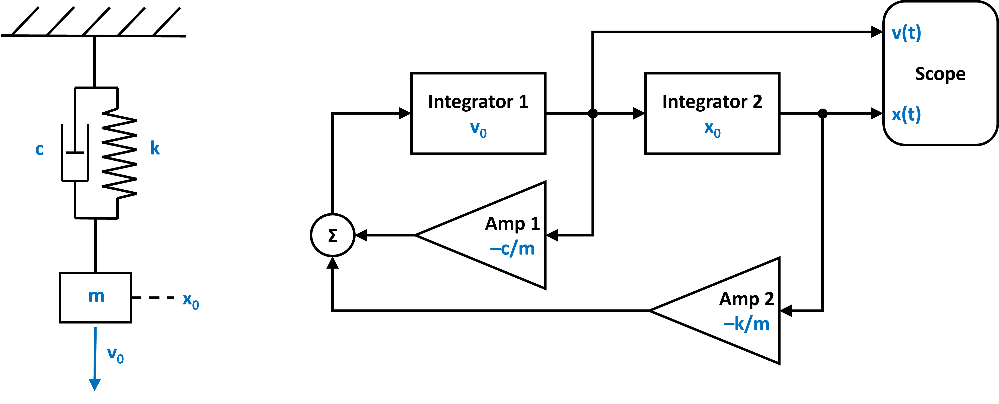
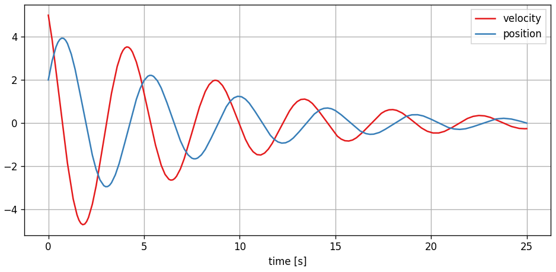

Harmonic Oscillator
-------------------

In this example we have a look at the damped harmonic oscillator. A linear dynamical system that models a spring-mass-damper system.

You can also find this example as a single file in the `GitHub repository <https://github.com/milanofthe/pathsim/blob/master/examples/example_harmonic_oscillator.py>`_.

The equation of motion that defines the harmonic oscillator it is given by

.. math::

    \ddot{x} + \frac{c}{m} \dot{x} + \frac{k}{m} x = 0

where `c` is the damping, `k` the spring constant (stiffness) and `m` the mass. The corresponding block diagramm can be translated into a netlist by using the blocks and the connection class provided by `PathSim`. 

First lets import the :class:`.Simulation` and :class:`.Connection` classes and the required blocks from the block library:

.. code-block:: python

    from pathsim import Simulation, Connection
    from pathsim.blocks import Integrator, Amplifier, Adder, Scope

Then lets define the system parameters:

.. code-block:: python

    #initial position and velocity
    x0, v0 = 2, 5

    #parameters (mass, damping, spring constant)
    m, c, k = 0.8, 0.2, 1.5

Now we can construct the system by instantiating the blocks we need (from the block diagram above) with their corresponding prameters and collect them together in a list:

.. code-block:: python

    #blocks that define the system
    I1 = Integrator(v0)   # integrator for velocity
    I2 = Integrator(x0)   # integrator for position
    A1 = Amplifier(c)
    A2 = Amplifier(k)
    A3 = Amplifier(-1/m)
    P1 = Adder()
    Sc = Scope(labels=["velocity", "position"])

    blocks = [I1, I2, A1, A2, A3, P1, Sc]

Afterwards, the connections between the blocks can be defined. The first argument of the :class:`.Connection` class is the source block and its port (`Sc[1]` would be port `1` of the instance of the :class:`.Scope` block). 

.. code-block:: python

    #the connections between the blocks
    connections = [
        Connection(I1, I2, A1, Sc), 
        Connection(I2, A2, Sc[1]),
        Connection(A1, P1), 
        Connection(A2, P1[1]), 
        Connection(P1, A3),
        Connection(A3, I1)
        ]

Finally we can instantiate the `Simulation` with the blocks, connections and some additional parameters such as the timestep. In this case, no special ODE solver is specified, so `PathSim` uses the default :class:`.SSPRK22` integrator which is a fixed step 2nd order explicit Runge-Kutta method. A good starting point for non stiff linear systems like this. 

.. code-block:: python

    #initialize simulation with the blocks, connections, timestep
    Sim = Simulation(blocks, connections, dt=0.01, log=True)

Then we can run the simulation for some duration:

.. code-block:: python
        
    #run the simulation for 20 seconds
    Sim.run(duration=25)

Due to the object oriented and decentralized nature of `PathSim`, the :class:`.Scope` block holds the recorded time series data from the simulation internally. It can be plotted directly in an external matplotlib window using the `plot` method

.. code-block:: python

    #plot the results from the scope
    Sc.plot()

which looks like an exponentially decaying sinusoid:

