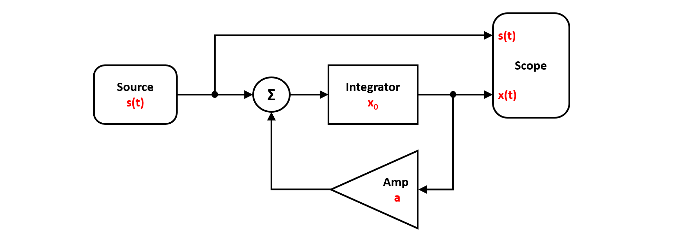

Linear Feedback System
----------------------

Here's a simple example of a linear feedback system, simulated with `PathSim`. 

You can also find this example as a single file in the `GitHub repository <https://github.com/milanofthe/pathsim/blob/master/examples/example_feedback.py>`_.

The block diagramm above can be translated to a netlist by using the blocks and the connection class provided by `PathSim`. First lets import the :class:`.Simulation` and :class:`.Connection` classes and the required blocks from the block library:

.. code-block:: python

    from pathsim import Simulation, Connection
    from pathsim.blocks import Source, Integrator, Amplifier, Adder, Scope

Then lets define the system parameters such as the initial value `x0` of the integrator, the linear feedback gain `a` and the time dependend source function `s(t)`.

.. code-block:: python

    #system parameters
    a, x0 = -1, 2

    #delay for step function
    tau = 3

    #step function
    def s(t):
        return int(t>tau)

Now we can construct the system by instantiating the blocks we need with their corresponding prameters and collect them together in a list:

.. code-block:: python

    #blocks that define the system
    Src = Source(s)
    Int = Integrator(x0)
    Amp = Amplifier(a)
    Add = Adder()
    Sco = Scope(labels=["step", "response"])

    blocks = [Src, Int, Amp, Add, Sco]

Afterwards, the connections between the blocks can be defined. The first argument of the `Connection` class is the source block and its port (`Src[0]` would be port `0` of the instance of the `Source` block, which is also the default port). 

.. code-block:: python

    #the connections between the blocks
    connections = [
        Connection(Src, Add[0], Sco[0]),
        Connection(Amp, Add[1]),
        Connection(Add, Int),
        Connection(Int, Amp, Sco[1])
        ]

Finally we can instantiate the `Simulation` with the blocks, connections and some additional parameters such as the timestep. In this case, no special ODE solver is specified, so `PathSim` uses the default :class:`.SSPRK22` integrator which is a fixed step 2nd order explicit Runge-Kutta method. A good starting point. Then we can run the simulation for some duration which is set as `4*tau` in this example.

.. code-block:: python

    #initialize simulation with the blocks, connections, timestep
    Sim = Simulation(blocks, connections, dt=0.01, log=True)
        
    #run the simulation for some time
    Sim.run(4*tau)

Due to the object oriented and decentralized nature of `PathSim`, the :class:`.Scope` block holds the recorded time series data from the simulation internally. It can be accessed by its `read` method

.. code-block:: python

    #read the data from the scope
    time, [data_step, data_response] = Sco.read()

or plotted directly in an external matplotlib window using the `plot` method

.. code-block:: python

    #plot the results from the scope
    Sco.plot()

which looks like this:

.. image:: figures/linear_feedback_result.png
   :width: 700
   :align: center
   :alt: simulation result of linear feedback system

