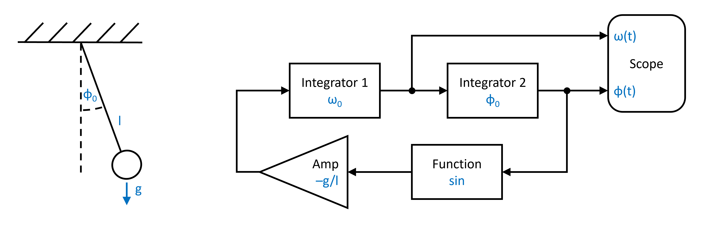
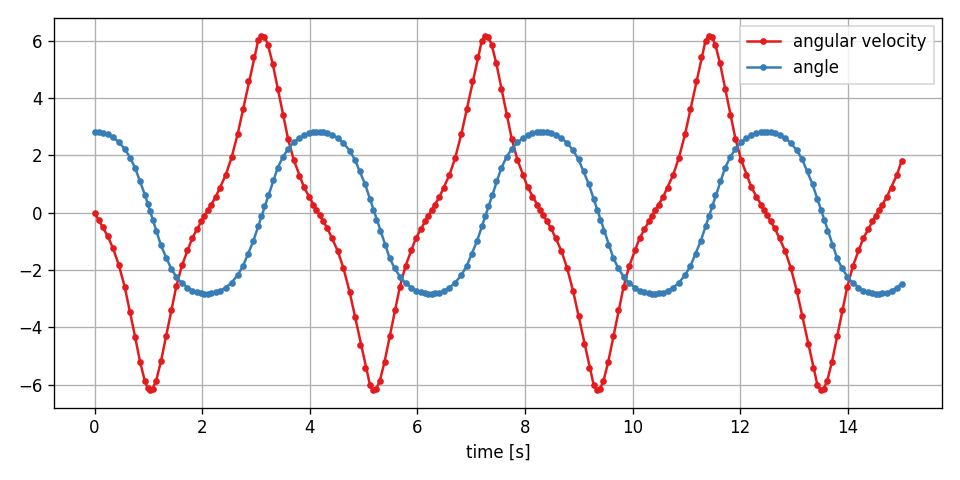
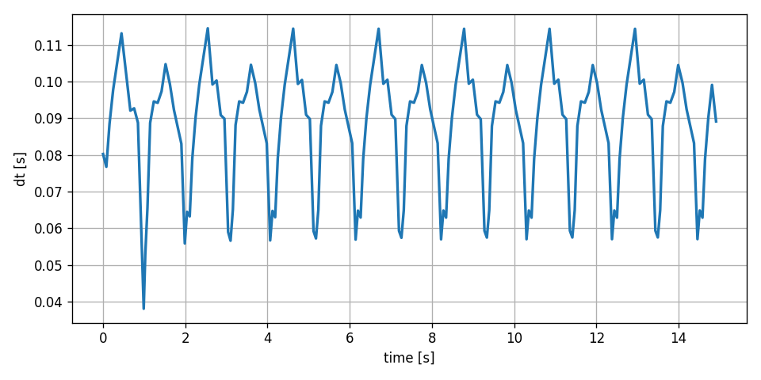

Pendulum
--------

In this example we have a look at the mathematical pendulum.

You can also find this example as a single file in the `GitHub repository <https://github.com/milanofthe/pathsim/blob/master/examples/example_pendulum.py>`_.

Above we have both the mechanical mode, which is a weight dangling from a string with length `l` and diverted by some initial angle, as well as the block diagram representation of the equation of motion to the right.

The equation of motion of the system is a nonlinear second order ODE:

.. math::

   \ddot{\phi} = - \frac{g}{l} \sin(\phi)

Lets transition to `Python` by importing the components we need to model the system from `PathSim` 

.. code-block:: python

   import numpy as np

   from pathsim import Simulation, Connection

   from pathsim.blocks import (Integrator, 
       Amplifier, Function, Adder, Scope)

   #using an adaptive runge-kutta method
   from pathsim.solvers import RKCK54

and define the system parameters. Here we choose an initial angle that is close to the pendulum beeing at the top:

.. code-block:: python

   #initial angle and angular velocity
   phi0, omega0 = 0.9*np.pi, 0

   #parameters (gravity, length)
   g, l = 9.81, 1

We can directly translate the block diagram above to `PathSim` blocks and connections:

.. code-block:: python

   #blocks that define the system
   In1 = Integrator(omega0) 
   In2 = Integrator(phi0) 
   Amp = Amplifier(-g/l) 
   Fnc = Function(np.sin)  # <- function blocks just take callables
   Sco = Scope(labels=["angular velocity", "angle"])

   blocks = [In1, In2, Amp, Fnc, Sco]

   #connections between the blocks
   connections = [
       Connection(In1, In2, Sco[0]), 
       Connection(In2, Fnc, Sco[1]),
       Connection(Fnc, Amp), 
       Connection(Amp, In1)
       ]

The simulation is initialized with the blocks and connections. In this case we dont use the default solver but an adaptive integrator :class:`.RKCK54` to ensure accuracy. Its an adaptive runge-kutta method from Cash and Karp, similar to Matlabs `ode45`, which is from Dormand and Prince and :class:`.RKDP54` in `PathSim`. The tolerances we set here, are also for the integrator. The adaptive method controls the timestep such that the local truncation error (lte) stays below the set tolerances.

.. code-block:: python

   #simulation instance from the blocks and connections
   Sim = Simulation(
       blocks, 
       connections, 
       dt=0.1, 
       Solver=RKCK54, 
       tolerance_lte_rel=1e-6, 
       tolerance_lte_abs=1e-8
       )

Finally we can run the simulation for some number of seconds and see what happens.

.. code-block:: python
   
   #run the simulation for 15 seconds
   Sim.run(duration=15)

   #plot the results directly from the scope
   Sco.plot(".-")   

Since we are using an adaptive integrator, it might be interesting to also look at the timesteps the simulation takes. To do this, we just get the times from the scope and compute the differences:

.. code-block:: python
   
   #read the recordings from the scope
   time, *_ = Sco.read()

   fig, ax = plt.subplots(figsize=(8,4), tight_layout=True, dpi=120)
   ax.plot(time[:-1], np.diff(time), lw=2)
   ax.set_ylabel("dt [s]")
   ax.set_xlabel("time [s]")
   ax.grid(True)

We can clearly see that the integrator takes smaller steps when the pendulum gets closer to regions where the solution trajectory is more dynamic to keep the local truncation error below the tolerances.