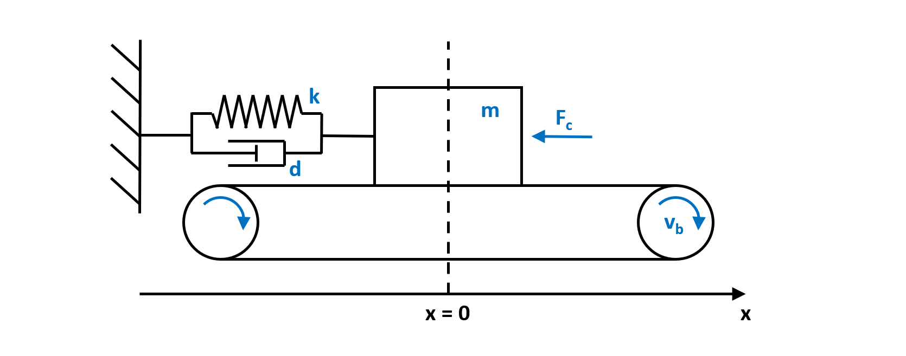
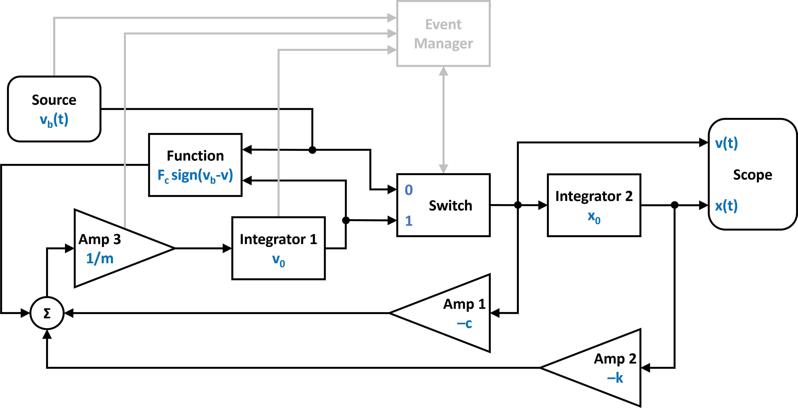
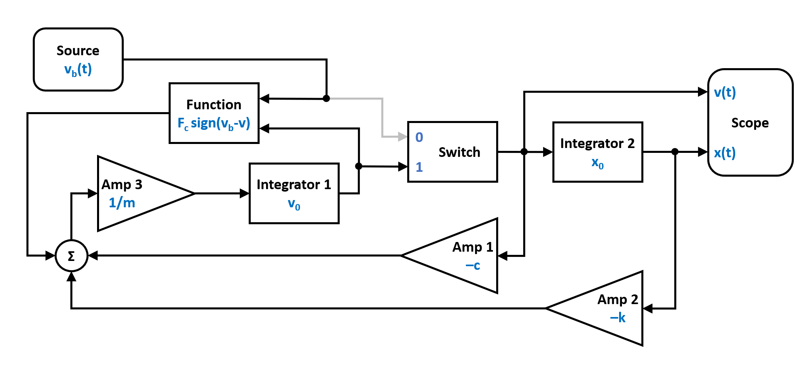
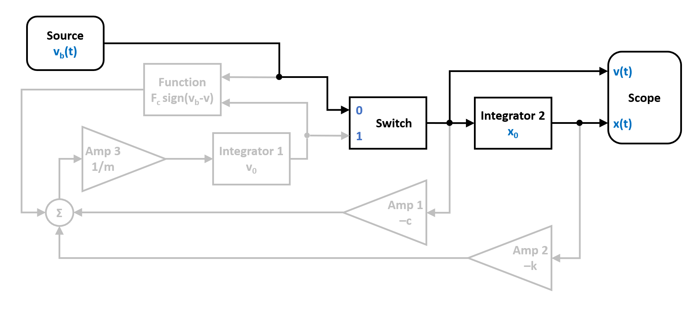
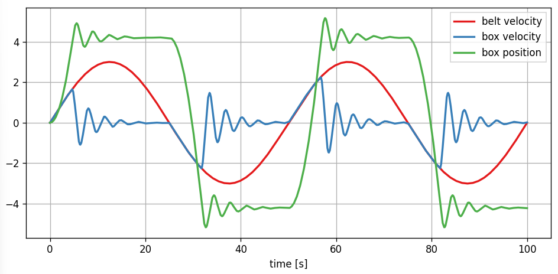

Stick Slip
----------

In this example we simulate a mechanical system that exhibits stick-slip behaviour, typical for coulomb friction. Lets consider the setup below, where we have a box sitting on a driven conveyor belt. The box is also coupled to a fixation by a spring-damper element. 

You can also find this example as a single file in the `GitHub repository <https://github.com/milanofthe/pathsim/blob/master/examples/examples_event/example_stickslip_event.py>`_.

This system has two possible states:
   
   1. The **slip** state where the box oscillates freely. Here we have the dynamical behaviour of a classical damped harmonic oscillator, a 2nd order ODE.

   2. The **stick** state where box exactly follows the belt. Here the box velocity is clamped to the belt velocity (algebraic constraint) and the system dynamics is reduced to a pure 1st order integration.

The two states transition from one to another depending on the relative velocity of the box to the belt and the force acting on the box. If the relative velocity is zero and the force is below some threshold, the system enters the **stick** state. When the force exceeds a certain threshold, the box breaks free and enters the **slip** state.

The continuous time dynamics for the two states have the following ODE(s):

.. math::
   
   \begin{cases}
   m \ddot{x} = - k x - d \dot{x} - F_c \, \mathrm{sign}\left( \dot{x} - v_b \right) & \text{slip}  \\
   \dot{x} = v_b & \text{stick}
   \end{cases}

with the sticking condition:
   
.. math::
   
   |k x + d v_b| \leq F_c

the transition condition from **slip to stick**, when:
   
.. math::

   \dot{x} = v_b \quad \text{and} \quad |k x + d v_b| \leq F_c

and from **stick to slip**, when 

.. math::

   |k x + d v_b| > F_c

The resulting switched system is shown in the block diagram below:

Note that the **event manager** tracks the system state and sets the switch to select the input of the position integrator.

The event manager effectively switches between the two signal flow graphs in the figures below. The slipping state:

And the stick state where the velocity is clamped and the position is just determined by the integrated belt velocity:

Now lets implement this hybrid dynamical system into `PathSim` starting with importing the :class:`.Simulation` and :class:`.Connection` classes and the required blocks from the block library:

.. code-block:: python
       
    from pathsim import Simulation, Connection

    #the blocks we need
    from pathsim.blocks import (
        Integrator, Amplifier, Function, 
        Source, Switch, Adder, Scope
        )

    #event managers
    from pathsim.events import ZeroCrossing, ZeroCrossingUp

    #adaptive explicit integrator (for backtracking)
    from pathsim.solvers import RKBS32

Next are the system parameters, including the function definitions for the :class:`.Source` and the :class:`.Function` blocks:

.. code-block:: python

    #initial position and velocity
    x0, v0 = 0, 0

    #system parameters
    m = 20.0    # mass
    k = 70.0    # spring constant
    d = 10.0    # spring damping
    mu = 1.5    # friction coefficient
    g = 9.81    # gravity
    v = 3.0     # belt velocity magnitude
    T = 50.0    # excitation period

    F_c = mu * m * g # friction force 

    #function for belt velocity
    def v_belt(t):
        return v * np.sin(2*np.pi*t/T)

    #function for coulomb friction force
    def f_coulomb(v, vb):
        return F_c * np.sign(vb - v)

Now we can construct the system by instantiating the blocks we need with their corresponding prameters and collect them together in a list:

.. code-block:: python

    #blocks that define the system dynamics
    Sr = Source(v_belt)      # velocity of the belt
    I1 = Integrator(v0)      # integrator for velocity
    I2 = Integrator(x0)      # integrator for position
    A1 = Amplifier(-d)
    A2 = Amplifier(-k)
    A3 = Amplifier(1/m)
    Fc = Function(f_coulomb) # coulomb friction (kinetic)
    P1 = Adder()
    Sw = Switch(1)           # selecting port '1' initially

    #blocks for visualization
    Sc1 = Scope(
        labels=[
            "belt velocity", 
            "box velocity", 
            "box position"
            ]
        )
    Sc2 = Scope(
        labels=[
            "box force",
            "coulomb force"
            ]
        )

    blocks = [Sr, I1, I2, A1, A2, A3, Fc, P1, Sw, Sc1, Sc2]

Afterwards, the connections between the blocks can be defined. The first argument of the :class:`.Connection` class is the source block and its port (`Src[0]` would be port `0` of the instance of the :class:`.Source` block, which is also the default port). 

.. code-block:: python

    #connections between the blocks
    connections = [
        Connection(I1, Sw[1], Fc[0]), 
        Connection(Sr, Sw[0], Fc[1], Sc1[0]), 
        Connection(Sw, I2, A1, Sc1[1]), 
        Connection(I2, A2, Sc1[2]), 
        Connection(A1, P1[0]), 
        Connection(A2, P1[1]), 
        Connection(Fc, P1[2], Sc2[1]),
        Connection(P1, A3, Sc2[0]), 
        Connection(A3, I1)
        ]

Next we need to define the two event managers for the state transitions of the system. They are of type :class:`.ZeroCrossing`:

.. code-block:: python

    #event for slip -> stick transition

    def slip_to_stick_evt(t):
        _1, v_box , _2 = Sw() 
        _1, v_belt, _2 = Sr()
        dv = v_box - v_belt 

        return dv

    def slip_to_stick_act(t):

        #change switch state
        Sw.select(0)

        I1.off()
        Fc.off()

        E_slip_to_stick.off()
        E_stick_to_slip.on()
       
    E_slip_to_stick = ZeroCrossing(
        func_evt=slip_to_stick_evt,                 
        func_act=slip_to_stick_act, 
        tolerance=1e-3
        )

    #event for stick -> slip transition

    def stick_to_slip_evt(t):
        _1, F, _2 = P1()
        return F_c - abs(F)

    def stick_to_slip_act(t):

        #change switch state
        Sw.select(1)

        I1.on()
        Fc.on()

        #set integrator state
        _1, v_box , _2 = Sw() 
        I1.engine.set(v_box)

        E_slip_to_stick.on()
        E_stick_to_slip.off()

    E_stick_to_slip = ZeroCrossing(
        func_evt=stick_to_slip_evt,                 
        func_act=stick_to_slip_act, 
        tolerance=1e-3
        )

    events = [E_slip_to_stick, E_stick_to_slip]

Finally we can instantiate the :class:`.Simulation` with the blocks, connections, events and some additional parameters such as the timestep. We use an adaptive timestep ODE solver :class:`.RKBS32` (its essentially the same as Matlabs `ode23`) so the event managemant system can use backtracking to accurately locate the events. Then we can run the simulation for some duration which is set as `2*T` (two periods of the source term) in this example.

.. code-block:: python

    #create a simulation instance from the blocks and connections
    Sim = Simulation(
        blocks, 
        connections, 
        events,
        dt=0.01, 
        dt_max=0.1, 
        log=True, 
        Solver=RKBS32, 
        tolerance_lte_abs=1e-6, 
        tolerance_lte_rel=1e-4
        )

    #run the simulation for some time
    Sim.run(2*T)

Lets have a look at the scopes and see what we got for the position and velocity:

.. code-block:: python

    #plot the recordings from the first scope
    Sc1.plot("-", lw=2)

And the scope that recorded the forces:

.. code-block:: python

    #plot the recordings from the second scope
    Sc2.plot("-", lw=2)

.. image:: figures/stick_slip_result_forces.png
   :width: 700
   :align: center
   :alt: results of stick slip system forces

