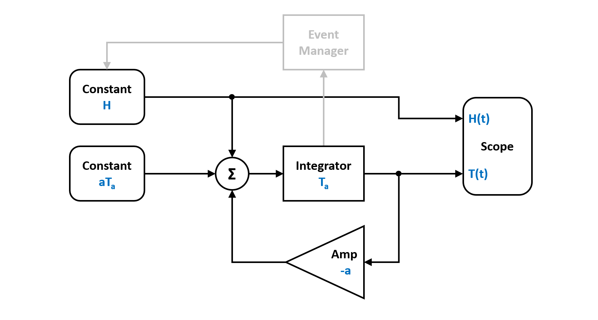
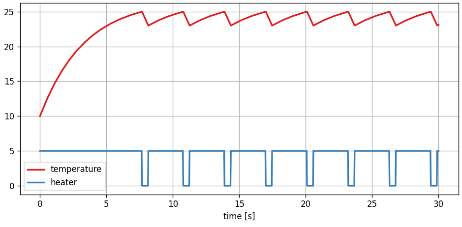
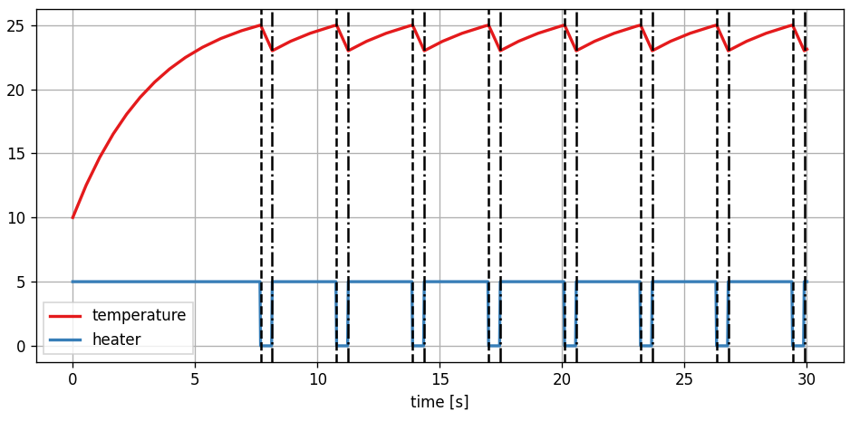

Thermostat
----------

In this example we have a look at a thermostat, which is a kind off discrete regulator. It switches a heating element on or of depending on defined upper and lower thresholds. 

You can also find this example as a single file in the `GitHub repository <https://github.com/milanofthe/pathsim/blob/master/examples/examples_event/example_thermostat.py>`_.

The continuous dynamics part of the system has the following two ODEs for the two heater states:

.. math::
    
    \begin{cases} 
    \dot{T} = - a ( T - T_a ) + H & \text{heater on} \\
    \dot{T} = - a ( T - T_a )     &  \text{heater off}
    \end{cases}

With some algebraic manipulations we can translate the system equation into a block diagram that can be implemented in `PathSim`. Note the event manager, that watches the state of the integrator and controls the heater.

Lets start by importing the :class:`.Simulation` and :class:`.Connection` classes and the required blocks from the block library. In addition to this we also need to define events to detect the threshold crossings for the regulator.

.. code-block:: python

    from pathsim import Simulation, Connection
    from pathsim.blocks import Integrator, Constant, Scope, Amplifier, Adder

    #event managers
    from pathsim.events import ZeroCrossingUp, ZeroCrossingDown

Then lets define the system parameters.

.. code-block:: python

    a = 0.3  #thermal capacity of room
    Ta = 10  #ambient temperature
    H = 5    #heater power
    Kp = 25  #upper temperature threshold 
    Km = 23  #lower temperature threshold

Now we can construct the continuous dynamic part of the system (its just a linear feedback system) by instantiating the blocks we need with their corresponding prameters and collect them together in a list:

.. code-block:: python

    #blocks that define the system
    sco = Scope(labels=["temperature", "heater"])
    integ = Integrator(Ta)
    feedback = Amplifier(-a)
    heater = Constant(H)
    ambient = Constant(a*Ta)
    add = Adder()

    #blocks of the main system
    blocks = [sco, integ, feedback, heater, ambient, add]

Afterwards, the connections between the blocks can be defined. The first argument of the :class:`.Connection` class is the source block and its port. The following blocks are the target blocks and their target ports: 

.. code-block:: python

    #the connections between the blocks
    connections = [
        Connection(integ, feedback, sco),
        Connection(feedback, add),
        Connection(heater, add[1], sco[1]),
        Connection(ambient, add[2]),
        Connection(add, integ)
        ]

Next we need to implement the event managers for the threshold based switching between the two heater states. 

.. code-block:: python
    
    #crossing upper threshold -> heater off

    def func_evt_up(t):
        *_, x = integ()
        return x - Kp

    def func_act_up(t):
        heater.off()

    E1 = ZeroCrossingUp(
        func_evt=func_evt_up, 
        func_act=func_act_up
        )

    #crossing lower threshold -> heater on

    def func_act_down(t):
        heater.on()
     
    def func_evt_down(t):
        *_, x = integ()
        return x - Km

    E2 = ZeroCrossingDown(
        func_evt=func_evt_down, 
        func_act=func_act_down
        )

    events = [E1, E2]

Finally we can instantiate the :class:`.Simulation` with the blocks, connections, events and some additional parameters such as the timestep. 

To enable backtracking for the event manager, we need to use an adaptive timestep integrator. Here we go for :class:`.RKBS32` which is a 3rd order Runge-Kutta method and essentially the same as Matlabs `ode23`. 

.. code-block:: python
    
    #import the adaptive integrator to enable backtracking
    from pathsim.solvers import RKBS32

    #initialize simulation 
    Sim = Simulation(
        blocks,     
        connections, 
        events, 
        dt=0.1, 
        dt_max=0.05, 
        log=True, 
        Solver=RKBS32
    )

Then we can run the simulation for some duration and see what happens.

.. code-block:: python
        
    #run simulation for some number of seconds
    Sim.run(30)

Due to the object oriented and decentralized nature of `PathSim`, the :class:`.Scope` block holds the recorded time series data from the simulation internally. It can be plotted directly in an external matplotlib window using the `plot` method

.. code-block:: python

    #plot the results from the scope
    sco.plot()

which looks like this:

There we can clearly see the switching of the heater and the room temperature oscillating between the upper and lower threshold. We can also add the events to the plot by just iterating the events to get the detected event times

.. code-block:: python

    #thermostat switching events
    for e in E1: 
        sco.ax.axvline(e, ls="--", c="k")
    
    for e in E2: 
        sco.ax.axvline(e, ls="-.", c="k")

which looks like this:

