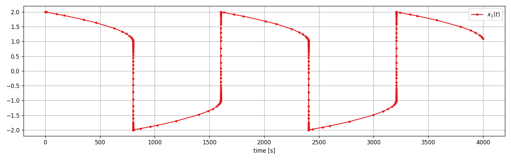
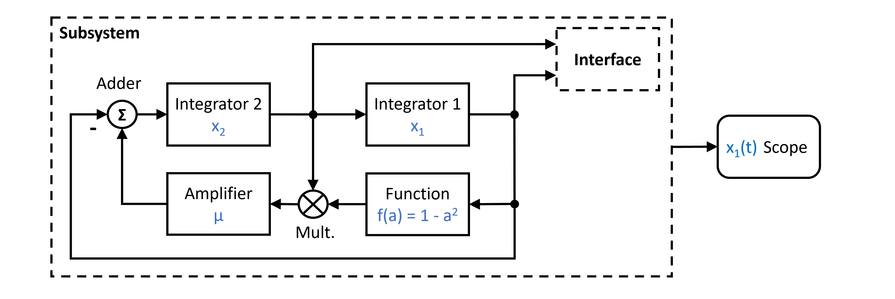
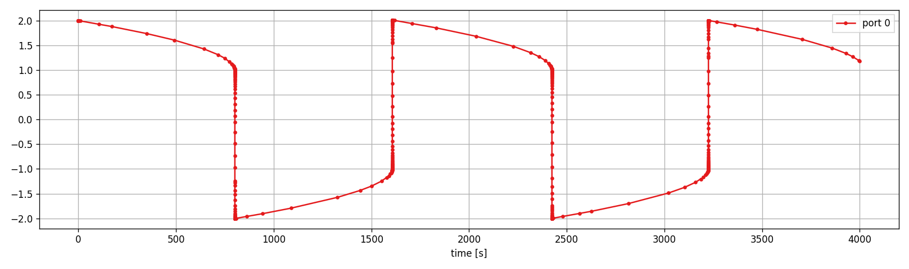

Van der Pol
-----------

Here we cover a true classic from the worldof dynamical systems. The *Van der Pol* system!

You can also find this example as a single file in the `GitHub repository <https://github.com/milanofthe/pathsim/blob/master/examples/examples_odes/example_vanderpol.py>`_.

It is described by the following 2nd order ODE

.. math::

    \ddot{x} + \mu (x^2 - 1) \dot{x} + x = 0

where the parameter :math:`\mu` controles the *stiffness* of the system. Stiffness in dynamical systems typically arises when the (local) internal time constants (eigenvalues of the Jacobian) are on different scales, or when very steep gradients are encountered. 

ODE solvers for stiff systems require large stability regions and therefore are usually implicit. PathSim has a *huge* range of implicit solvers (i.e. :class:`.ESDIRK32`, :class:`.ESDIRK43`, :class:`.GEAR52A`, ...), that can be used to solve stiff systems, such as the *Van der Pol* system with very large :math:`\mu`, reliably. Lets see how this works.

PathSim supplies a specific block to define differential equations, the :class:`.ODE` block. To accept the *Van der Pol* system, we have to convert the 2nd order ODE into a system of 1st order ODEs:

.. math::

    \begin{eqnarray}
        \dot{x}_1 &= x_2 \\
        \dot{x}_2 &= \mu (1 - x_1^2) x_2 - x_1
    \end{eqnarray}

As a block diagram it would look like this:

And translated to PathSim like this:

.. code-block:: python
    
    from pathsim import Simulation, Connection
    from pathsim.blocks import Scope, ODE
    from pathsim.solvers import GEAR52A # <- implicit solver for stiff systems

    #initial condition
    x0 = np.array([2, 0])

    #van der Pol parameter
    mu = 1000 # <- this is very stiff

    def func(x, u, t):
        return np.array([x[1], mu*(1 - x[0]**2)*x[1] - x[0]])

    #analytical jacobian (optional)
    def jac(x, u, t):
        return np.array([[0, 1], [-mu*2*x[0]*x[1]-1, mu*(1 - x[0]**2)]])

    #blocks that define the system
    VDP = ODE(func, x0, jac) #jacobian improves convergence
    Sco = Scope(labels=[r"$x_1(t)$"])

    blocks = [VDP, Sco]

    #the connect the blocks
    connections = [
        Connection(VDP, Sco)
        ]

    #initialize simulation
    Sim = Simulation(
        blocks, 
        connections,
        Solver=GEAR52A, 
        tolerance_lte_abs=1e-5, 
        tolerance_lte_rel=1e-3,
        tolerance_fpi=1e-8
        )

Here we define the paramter :math:`\mu = 1000` (btw. :math:`\mu = 10000` also works), which means severe stiffness! This is pretty much a torture test for stiff ODE solvers.

Lets run the simulation and look at the results:

.. code-block:: python
    
    #run it
    Sim.run(4*mu)

    #plotting
    Sco.plot(".-")

.. _ref-vanderpol-subsystem:

Van der Pol - as a Subsystem
----------------------------

Of course we dont have to use the :class:`.ODE` block to implement the *Van der Pol* system. We can also use other native PathSim blocks to achieve the same result!

This is the right moment to talk about PathSim hierarchical modeling capability. The :class:`.Subsystem` class enables the encapsulation of blocks and connections such that they can be treated as a single block from the outside. 

Lets use a :class:`.Subsystem` with distinct internal blocks and connections to emulate the :class:`ODE` block from above. In the block diagram paradigm this might look like this:

To translate it to PathSim, lets first build the *Van der Pol* block as a :class:`.Subsystem` (visit `GitHub <https://github.com/milanofthe/pathsim/blob/master/examples/example_vanderpol_subsystem.py>`_ for this example to run it yourself):

.. code-block:: python

    from pathsim import Simulation, Connection, Interface, Subsystem
    from pathsim.blocks import Integrator, Scope, Adder, Multiplier, Amplifier, Function
    from pathsim.solvers import GEAR52A # <- implicit solver for stiff systems

    #initial condition
    x1_0 = 2
    x2_0 = 0

    #van der Pol parameter
    mu = 1000

    #subsystem to emulate ODE block
    If = Interface()
    I1 = Integrator(x1_0)
    I2 = Integrator(x2_0)
    Fn = Function(lambda a: 1 - a**2)
    Pr = Multiplier()
    Ad = Adder("-+")
    Am = Amplifier(mu)

    sub_blocks = [If, I1, I2, Fn, Pr, Ad, Am]
    sub_connections = [
        Connection(I2, I1, Pr[0], If[1]), 
        Connection(I1, Fn, Ad[0], If[0]), 
        Connection(Fn, Pr[1]),
        Connection(Pr, Am),
        Connection(Am, Ad[1]),
        Connection(Ad, I2)
        ]

    #the subsystem acts just like a normal block
    VDP = Subsystem(sub_blocks, sub_connections)

Subsystems in PathSim hold their own internal blocks and connections. The communication to the outside is realized by a special :class:`.Interface` block, that the internal blocks are connected to. The inputs of this block are passed to the outputs of the :class:`Subsystem` and the inputs of the :class:`Subsystem` are passed to the outputs of the :class:`Interface`.

Now, `VDP` behaves just like the :class:`.ODE` block from above. Lets continue with the top level system:

.. code-block:: python

    #blocks of the main system
    blocks = [VDP, Sco]

    #the connections between the blocks in the main system
    connections = [
        Connection(VDP, Sco)
        ]

    #initialize simulation with the blocks, connections, timestep and logging enabled
    Sim = Simulation(
        blocks, 
        connections, 
        Solver=GEAR52A, 
        tolerance_lte_abs=1e-5, 
        tolerance_lte_rel=1e-3,
        tolerance_fpi=1e-8
        )

Run the simulation and see what happens:

.. code-block:: python
    
    #run it
    Sim.run(4*mu)

    #plotting
    Sco.plot(".-")

