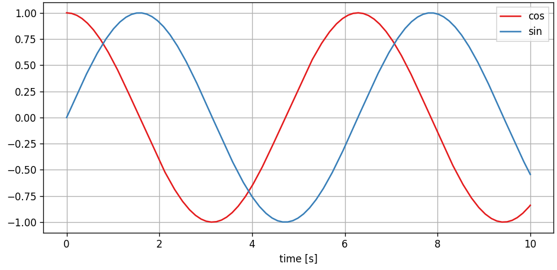

.. pathsim documentation master file, created by
   sphinx-quickstart on Wed Feb 19 13:55:01 2025.
   You can adapt this file completely to your liking, but it should at least
   contain the root `toctree` directive.

PathSim - A System Simulation Framework
=======================================

**PathSim** is a flexible block-based time-domain system simulation framework in Python with automatic differentiation capabilities and an event handling mechanism! It provides a variety of classes that enable modeling and simulating complex interconnected dynamical systems through Python scripting.

All of that with minimal dependencies, only `numpy`, `scipy` and `matplotlib`!

Key Features:

- **Hot-swappable** blocks and solvers during simulation
- Blocks are inherently **MIMO** (Multiple Input, Multiple Output) capable
- Wide range of **numerical integrators** (implicit, explicit, high order, adaptive)
- **Modular and hierarchical** modeling with (nested) subsystems (see :class:`.Subsystem` and :ref:`ref-vanderpol-subsystem`)
- **Event handling** system to detect and resolve discrete events (zero-crossing detection, see :ref:`ref-bouncing-ball`)
- Automatic differentiation for **fully differentiable** system simulations (see :ref:`ref-tutorials-ad`)
- **Extensibility** by subclassing the base `Block` class and implementing just a handful of methods

The source code can be found in the `GitHub repository <https://github.com/milanofthe/pathsim>`_ and is fully open source under MIT license. Consider starring PathSim to support its development.

Quickstart
----------

1. **Install** PathSim with `pip <https://pypi.org/project/pathsim/>`_:

.. code-block:: bash

    pip install pathsim

2. **Build** a dynamical system using blocks and connections. Here we just integrate a cosine:

Which looks like this, translated to PathSim:

.. code-block:: python
    
    import numpy as np

    from pathsim import Simulation, Connection
    from pathsim.blocks import Source, Integrator, Scope

    #these are the blocks of our system
    Sr = Source(np.cos)
    In = Integrator()
    Sc = Scope(labels=["cos", "sin"])

    #simulation instance with blocks and connections
    Sim = Simulation(
        blocks=[Sr, In, Sc], 
        connections=[
            Connection(Sr, In),
            Connection(Sr, Sc[0]),
            Connection(In, Sc[1]),
            ], 
        dt=0.01 
        )
        

3. **Run** the simulation and look at the results:

.. code-block:: python
    
    #run for 10 time units
    Sim.run(10)

    #plot the scope
    Sc.plot()

Table of Contents
-----------------

This documentation is structured in the following way. There are a number of **examples** that almost have tutorial-charakter and of course the **API-reference**.

.. toctree::
   :maxdepth: 2

   examples
   tutorials
   roadmap
   contributing
   api
   

Indices and tables
==================

* :ref:`genindex`
* :ref:`modindex`