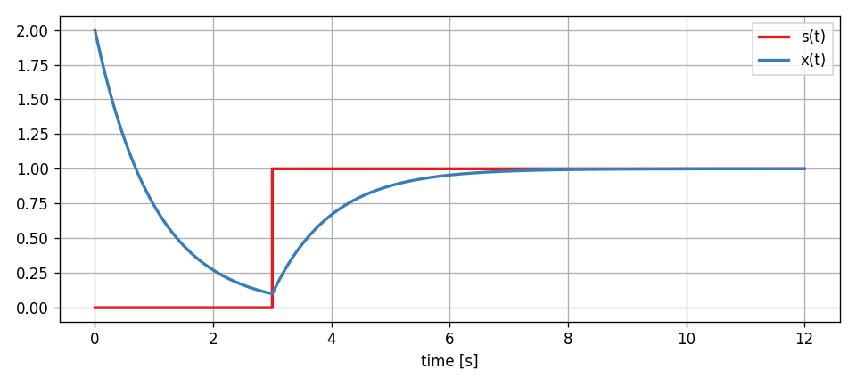
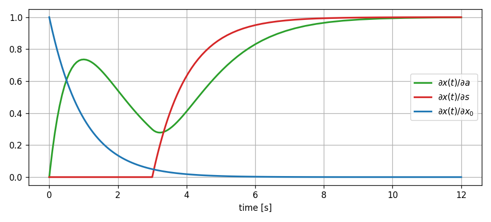
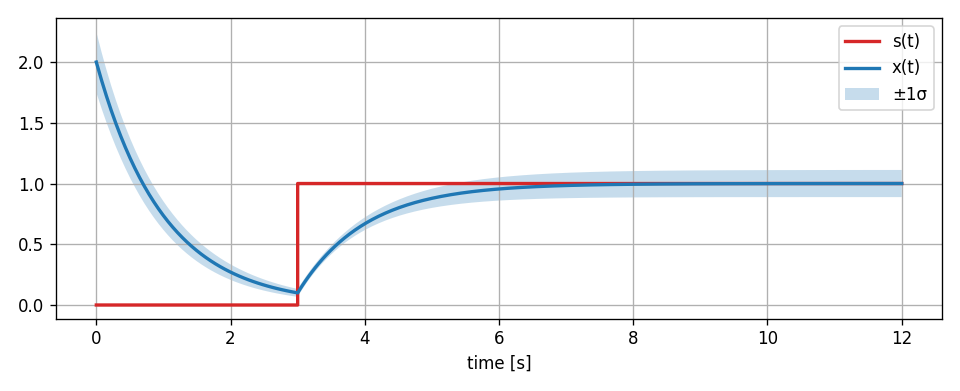

.. _ref-tutorials-ad:

Automatic Differentiation
=========================

PathSim has an integrated framework for automatic differentiation (forward mode AD) within the :mod:`.optim` module. It mainly consists of the :class:`.Value` class that implements arithmetic operations and numpy ufuncs via operator overloading to propagate gradients through a computational graph. 

For a dynamical system simulation framework such as PathSim, this is very consequential. All the operations in the simulation loop, all solver steps, all algebraic and dynamic updates are purely algebraic on the numerics side. 

This means, that when the simulation loop is sufficiently robust to handle all kinds of python objects (as long as they implement the core arithmetic operations needed), they can be used instead of regular floating point numbers to advance the simulation.

Value class and derivatives
---------------------------

To understand this better, lets first have a look at what the :class:`.Value` class does by comparing it to standard float operations. Lets say we have the following function

.. code-block:: python
      
   import numpy as np

   def f(a, b, c):
      return (a**2 - b) * np.cos(c)

that consists of multiple input arguments, and a asingle output that is obtained by some algebraic operations applied in some order to the inputs.

Lets start by evaluating our function with some regular floats:

.. code-block:: python
   
   #inputs are just regular floats
   x, y, z = 1.1, 3.5, 2.0

   w = f(x, y, z)

   print(w) #0.9529762556929561
   

As expected we get a float back. Next wrap the same floats into :class:`.Value` instances by using the :meth:`.Value.array` classmethod:

.. code-block:: python
      
   from pathsim.optim import Value

   #inputs are Value instances
   x, y, z = Value.array([1.1, 3.5, 2.0])
   
   w = f(x, y, z)

   print(w) #Value(val=0.9529762556929561, grad=defaultdict(<class 'float'>, {2565427398528: np.float64(-0.9155230404037134), 2565426875648: np.float64(0.4161468365471424), 2565403265920: np.float64(2.082291107430811)}))
   

Here the values propagate seemlessly through the operations and the final output is gain of type :class:`.Value`. But this one has trackted the derivatives within the internal gradient `dict` alongside the actual float evaluation. The gradients can be extracted by using the :meth:`.Value.__call__` method with the value instance we want to extract the derivative of like this:

.. code-block:: python
      
   dw_dx = w(x)
   dw_dy = w(y)
   dw_dz = w(z)

   print(dw_dx) #-0.9155230404037134
   print(dw_dy) #0.4161468365471424
   print(dw_dz) #2.082291107430811
   

Or in a more general way that also works with arrays of Value instances with the class method :meth:`.Value.der`:

.. code-block:: python
      
   dw_dx = Value.der(w, x)
   dw_dy = Value.der(w, y)
   dw_dz = Value.der(w, z)   

The main application for the :class:`.Value` class is enabling sensitivity analysis and end-to-end differentiability for PathSim simulations. Its also used for automatic linearization of operators (:meth:`.Operator.jac`), but more on that later.

Sensitivity Analysis
--------------------

Sensitivity analysis is fundamentally about understanding how changes in input parameters propagate through a dynamic system to affect its outputs. In mathematical terms, if we have a system output :math:`y = f(x, p)` that depends on state :math:`x` and parameters :math:`p`, the sensitivity :math:`S_p` with respect to parameter :math:`p` is defined as:

.. math::

   S_p = \frac{\partial y}{\partial p}

For dynamical systems where states evolve according to differential equations:

.. math::

   \frac{dx}{dt} = f(x, p, t)

The sensitivity trajectories themselves follow their own differential equations, derived by differentiating the original system equations with respect to parameters:

.. math::

   \frac{d}{dt}\left(\frac{\partial x}{\partial p}\right) = \frac{\partial f}{\partial x}\frac{\partial x}{\partial p} + \frac{\partial f}{\partial p}

PathSim's automatic differentiation approach allows computing these sensitivities without explicitly deriving and solving these sensitivity equations. Instead, the gradients are propagated through the computational graph represented by the simulation steps.

Linear Feedback Sensitivities
-----------------------------

Lets see how this works with a small example. A linear feedback system.

.. image:: figures/linear_feedback_blockdiagram.png
   :width: 700
   :align: center
   :alt: block diagram of linear feedback system

The system dynamics from the diagram above, can be represented by the first order ODE:

.. math::

   \frac{dx}{dt} = a x + s(t)

Translating the block diagram to PathSim looks like this:

.. code-block:: python

   from pathsim import Simulation, Connection
   from pathsim.blocks import Source, Integrator, Amplifier, Adder, Scope

   #AD framework
   from pathsim.optim import Value 

   #step delay
   tau = 3 

   #parameters for AD and standard deviations (the only difference to regular simulation setup)
   a  = Value(-1, sig=0.1)
   s  = Value(1, sig=0.05)
   x0 = Value(2, sig=0.5)

   #step function with delay
   def step(t): 
       return s*float(t>tau)

   #blocks defining the system
   src = Source(step)
   itg = Integrator(x0)
   amp = Amplifier(a)
   add = Adder()
   sco = Scope(labels=["s(t)", "x(t)"])

   #initialize simulation
   sim = Simulation(
       blocks=[src, itg, amp, add, sco], 
       connections=[
           Connection(src, add[0], sco[0]),
           Connection(amp, add[1]),
           Connection(add, itg),
           Connection(itg, amp, sco[1])
       ], dt=0.01) 

   #run simulation for some time
   sim.run(4*tau)

   #plot the results
   sco.plot() 

Now, after the simulation has finished, the results that the :class:`.Scope` has recorded are not regular floats but :class:`.Value` instances that have tracked the partial derivatives through the whole system dynamics.

.. code-block:: python  

   #get the simulation results
   time, [_, x] = sco.read()

   #extract the sensitivities
   dx_da = Value.der(x, a)
   dx_ds = Value.der(x, s)
   dx_dx0 = Value.der(x, x0)

   #plotting, etc.

The sensitivities we calculated provide specific insights:

1. :math:`\frac{\partial x}{\partial a}` (dx_da): Shows how the feedback gain affects the system response. Negative values indicate that increasing the gain would reduce the state value at that time.

2. :math:`\frac{\partial x}{\partial s}` (dx_ds): Illustrates the system's sensitivity to input amplitude. This reveals how input scaling propagates through the feedback structure. For the linear system, this selects the normalized particular solution from the ODE.

3. :math:`\frac{\partial x}{\partial x_0}` (dx_dx0): Demonstrates how initial conditions influence the trajectory over time. In stable systems, this sensitivity typically decays, showing diminishing influence of initial conditions. For linear systems, this selects the normalized homogenous solution of the ODE.

Sensitivity Analysis and Uncertainty Quantification
---------------------------------------------------

Sensitivity analysis forms a critical bridge to uncertainty quantification. When parameters have associated uncertainties, the sensitivities allow approximating how these uncertainties propagate to the outputs.

For a parameter :math:`p` with uncertainty :math:`\sigma_p`, the corresponding contribution to output uncertainty can be approximated using a first-order Taylor expansion:

.. math::

   \sigma_y^2 \approx \sum_i \left(\frac{\partial y}{\partial p_i}\right)^2 \sigma_{p_i}^2

This is particularly valuable in engineering applications where parameters often have associated measurement or estimation uncertainties.

We can extend our linear feedback example to incorporate uncertainty. The :meth:`.Value.var` staticmethod can be used to approximate the total variance of the output signal from the individual standard deviations of the parameters using the propagated partial derivatives.

.. code-block:: python

   #extract output variance at each time point
   var_x = Value.var(x, [a, s, x0])
   
   #standard deviation bounds
   x_upper = x + np.sqrt(var_x)
   x_lower = x - np.sqrt(var_x)
   
   #plotting, etc.

It should be noted that this kind of uncertainty analysis using taylor approximations only really makes sense in linear systems or in nonlinear systems for small uncertainties (comparable to a small signal analysis, its still an approximation). Otherwise the linearization will not be sufficiently accurate. In the simple feedback system of our example, its not an issue however, because its inherently linear.