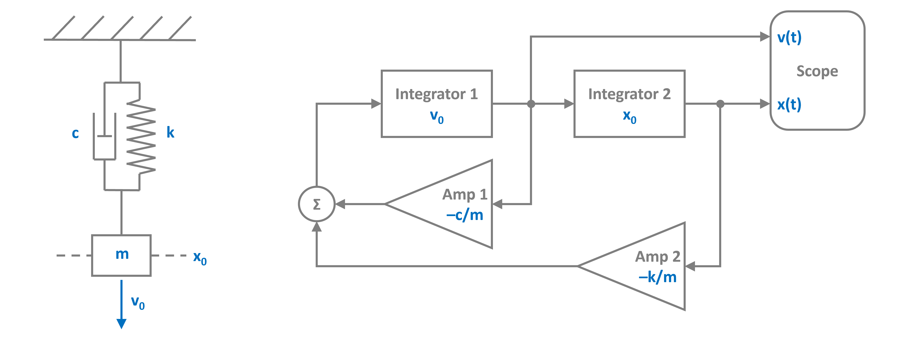
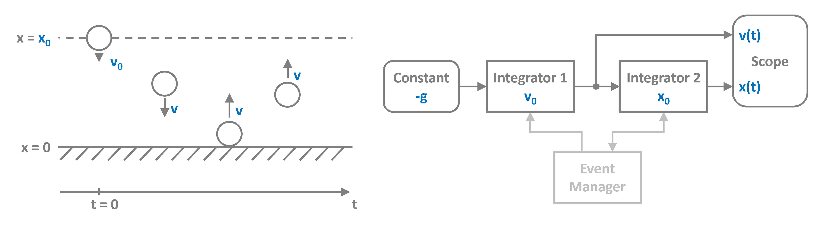

# Summary

PathSim is a flexible, block-based, time-domain dynamical system simulation framework implemented in Python. It enables the modeling and simulation of complex interconnected systems from their signal flow graphs, similar to MathWorks Simulink [@Simulink] using an object-oriented and decentralized architecture. This architectural choice distinguishes PathSim by distributing state and computation across individual `Block` components, promoting modularity, extensibility, and flexibility. Core components include user-defined or built-in `Block` objects encapsulating specific behaviors, `Connection` objects defining explicit data flow, and a `Simulation` object managing time evolution and coordination. Dynamic blocks possess their own numerical solver instances (`engine`) for state integration. PathSim incorporates advanced features i.e. (forward mode) automatic differentiation for sensitivity analysis or gradient based optimization, discrete event handling for hybrid systems, automatic system- or block-level linearization, hierarchical modeling through subsystems, and a comprehensive suite of ODE solvers suitable for stiff problems. It requires only core scientific Python libraries: NumPy [@harris2020array], SciPy [@virtanen2020scipy], and Matplotlib [@hunter2007matplotlib].

# Statement of Need

Modeling and simulating dynamical systems is vital across many disciplines such as control engineering, chemical process engineering, and mixed signal engineering. Challenges are often the interplay of multiple *coupled* subsystems with their distinct dynamics and behaviors which have to be solved and synchronized concurrently to advance the full system simulation.

PathSim meets the need for an open source simulation framework in the block-diagram paradigm with minimal dependencies, which integrates seamlessly into the Python ecosystem. Traditional simulation tools often rely on centralized solvers, proprietary file formats or compiled code, which can limit flexibility and extensibility within the Python ecosystem. PathSim's decentralized architecture offers distinct advantages: enhanced modularity (blocks are self-contained units), straight forward extensibility (new blocks integrate naturally without core modification), and greater flexibility in model composition and analysis. Additionally this opens up block level solver optimizations, integration with other simulation environments (co-simulation) and hardware in the loop (HiL) setups through encapsulation within blocks, as well as integration into machine-learning pipelines.

Specifically PathSim offers:

* **Open Source Alternative:** An open source alternative to legacy block-diagram system simulation frameworks.
* **Accessible Hybrid System Simulation:** Integrates event detection (zero-crossing, scheduled) directly into the block-diagram paradigm, simplifying the modeling of systems with both *continuous and discrete dynamics*.
* **Hierarchical Modeling:** Subsystem blocks that encapsulate their own blocks and connections to *manage model complexity*.
* **Gradient-Enabled Simulation:** Provides built-in *automatic differentiation* for sensitivity analysis and integration with gradient-based optimization or machine learning frameworks.
* **Unified Framework for Diverse Dynamics:** Offers a wide range of solvers, including implicit methods (ESDIRK, BDF/GEAR) for *stiff systems*.
* **Extensibility in Python:** Leverages the scientific Python ecosystem with minimal dependencies. Its architecture allows straightforward creation and integration of custom blocks.

# Comparison to Existing Tools

MathWorks Simulink [@Simulink] is the defacto industry standard for system modeling in the block diagram paradigm. Its a proprietary tool with significant licensing costs. Besides that, other equation based modeling frameworks such as `Modelica` [@ModelicaRepo] with its own model description language are also used but not as widely adopted.

Several Python tools for simulating dynamical systems have emerged over the years. Standard ODE solvers like `scipy.integrate.solve_ivp` [@virtanen2020scipy] offer robust integration but lack a structured framework for modeling complex, interconnected systems or handling discrete events natively Uses have to manually derive the govering system equations. The *Python Control Systems Library* [@pythoncontrol] is a popular package for modeling and optimizing dynamical systems from the control engineering perspective primarily. The package `tbcontrol` [@tbcontrol] similarly focuses on control systems. Libraries like `SimuPy` [@Margolis2017; @SimuPyRepo] provide a block-based modeling approach similar to PathSim, leveraging SymPy for symbolic definition and SciPy solvers for integration. Other frameworks like `Collimator` [@pycollimator] offer graphical interfaces and JAX-based acceleration but require compilation and introduce dependencies beyond the standard scientific Python stack. `bdsim` [@bdsimRepo] also provides block diagram simulation, based on Scipy solvers, with a strong focus on robotics but without event handling. 

PathSim differentiates itself by offering a script-based block-diagram interface with a *decentralized architecture*, native integration of both *automatic differentiation* and *discrete event handling* into the full simulation loop, capable of handling *algebraic loops*, and a *built-in library* of independently implemented and verified ODE solvers (beyond wrapping SciPy). Its fully open under *MIT-License* with *minimal core dependencies*.

# Architecture and Design

PathSim employs a decentralized, object-oriented design centered around three primary components:

1.  **Blocks (`Block`):** Represent individual system components or operations. They encapsulate their parameters and, if stateful (like `Integrator`, `StateSpace` or `ODE`), manage their own internal state via a dedicated numerical integration engine (`engine`) instance. This contrasts with centralized approaches where a single solver manages all system states. Blocks define `update` methods for algebraic computations within a timestep and `step`/`solve` methods for interacting with their `engine` for state evolution. The `Subsystem` class shares the same interface as the base `Block` and is treated by the main simulation loop as such. This enables arbitrary encapsulation and nesting.
2.  **Connections (`Connection`):** Define the explicit data flow pathways between block output ports and input ports, mirroring the connections in a block diagram. 
3.  **Simulation (`Simulation`):** Coordinates the overall simulation process. It maintains the list of blocks and connections. It assembles directed graphs of the block dependencies that is used to evaluate the algebraic parts of the global system function. `Connection.update()` propagates output values to inputs, and `Block.update()` computes algebraic outputs based on current inputs and states. Algebraic loop blocks are stored in a separate graph and resolved iteratively in a second stage. The `Simulation` object then triggers the `step` (for explicit solvers) or `solve` (for implicit solvers) methods of the blocks' engines to advance their internal states. It also manages the event handling system.

# PathSim Modelling Flow

PathSim is a script based modelling framework, with no built in graphical user interface. Therefore it makes sense to start from the block diagram of the system to be modelled. The following sections demonstrate PathSims modelling and simulation flow. The examples cover classical dynamical systems such as the *harmonic oscillator*, the *bouncing ball* (to showcase the event handling system) and the *Van der Pol* system (as a stiff subsystem).

## Harmonic Oscillator

The figure below shows the mechanical representation of the harmonic oscillator to the left and its block diagram to the right.



Translating it to PathSim involves importing the blocks from the block library, instantiating them with their correct parameters, connecting them with the `Connection` object and passing everything to the `Simulation`.

```python
from pathsim import Simulation, Connection
from pathsim.blocks import Integrator, Amplifier, Adder, Scope

#initial position and velocity
x0, v0 = 2, 5

#parameters (mass, damping, spring constant)
m, c, k = 0.8, 0.2, 1.5

#blocks that define the system
I1 = Integrator(v0)   # integrator for velocity
I2 = Integrator(x0)   # integrator for position
A1 = Amplifier(-c/m)
A2 = Amplifier(-k/m)
P1 = Adder()
Sc = Scope(labels=["velocity", "position"])

blocks = [I1, I2, A1, A2, P1, Sc]

#connections between the blocks
connections = [
    Connection(I1, I2, A1, Sc), 
    Connection(I2, A2, Sc[1]),
    Connection(A1, P1), 
    Connection(A2, P1[1]), 
    Connection(P1, I1)
    ]

#create a simulation instance from the blocks and connections
Sim = Simulation(blocks, connections)

#run the simulation for some time
Sim.run(25)

#plot the results directly from the scope
Sc.plot()

#or read them out for postprocessing
time, [vel, pos] = Sc.read()
```

The `Scope` block enables fast plotting of the simulation results as well as their retrieval. 


## Bouncing Ball

The classical example for demonstrating event handling is the bouncing ball. The ball accelerates downward due to gravity and onece it hits the floor, it bounces back. The dynamics of this system are discontinuous due to the jump in velocity (sign change) exactly at the bounce. This is called a discrete event, specifically a zero-crossing event. Systems like this require the location and resolution of discrete events within the timestep and are not easily solved with standard numerical ODE solvers. **PathSim** implements an event management system, that can track the system state and locate and resolve specified events. 



The following code block defines the bouncing ball system in PathSim, utilizing the `ZeroCrossing` event manager to track the height of the ball and trigger the jump in velocity.

```python
from pathsim import Simulation, Connection
from pathsim.blocks import Integrator, Constant, Scope
from pathsim.events import ZeroCrossing #event manager
from pathsim.solvers import RKBS32 #adaptive solver

#elasticity of bounce and gravitational acceleration
b, g = 0.9, 9.81

#initial conditions
x0, v0 = 1, 5

#blocks that define the system
Ix = Integrator(x0)     # v -> x
Iv = Integrator(v0)     # a -> v 
Cn = Constant(-g)       # gravitational acceleration
Sc = Scope(labels=["x", "v"])

blocks = [Ix, Iv, Cn, Sc]

#the connections between the blocks
connections = [
    Connection(Cn, Iv),
    Connection(Iv, Ix),
    Connection(Ix, Sc[0])
    ]

#event function for zero crossing detection
def func_evt(t):
    *_, x = Ix() #get block outputs and states
    return x

#action function for state transformation
def func_act(t):
    *_, x = Ix()
    *_, v = Iv()
    Ix.engine.set(abs(x))
    Iv.engine.set(-b*v)

#events (zero crossing)
E1 = ZeroCrossing(
    func_evt=func_evt,                 
    func_act=func_act, 
    tolerance=1e-4
    )

events = [E1]
             
#initialize simulation from blocks, connections and events
Sim = Simulation(
    blocks, 
    connections, 
    events, 
    dt=0.01, 
    dt_max=0.04,
    Solver=RKBS32
    )

#run the simulation
Sim.run(10)

#read the recordings from the scope direclty
time, [data_x] = Sc.read()  

#plot the recordings from the scope
fig, ax = Sc.plot()

#add detected events to scope plot
for t in E1: 
    ax.axvline(t, ls="--", c="k")

```

The results (plotted from the `Scope`) show the evolution of ball accross time. The dashed lines indicate the locations of the bounces (detected events):


## Van der Pol System

Another classic dynamical system is the *Van der Pol* oscillator, which is described by the second order nonlinear ODE


$$\begin{eqnarray}
    \dot{x}_1 &= x_2 \\
    \dot{x}_2 &= \mu (1 - x_1^2) x_2 - x_1
\end{eqnarray}$$


where the parameter $\mu$ controls the *stiffness*. Stiffness in dynamical systems typically arises when the (local) internal time constants (eigenvalues of the Jacobian) are on vastly different scales, or when very steep gradients are encountered. This forces explicit integrators to take extremely small timesteps in order for the discretized system to be stable. Implicit solvers have larger areas of stability and are therefore a better choice for stiff problems like the *Van der Pol* system for large $\mu$. In this example, we select the parameter $\mu = 1000$ as a torture test to demonstrate PathSim's ability to handle severe stiffness. 


The following code implements the *Van der Pol* system with the basic **PathSim** blocks and encapsulates it into a `Subsystem`. 

```python

from pathsim import Simulation, Connection, Interface, Subsystem
from pathsim.blocks import Integrator, Scope, Adder, Multiplier, Amplifier, Function
from pathsim.solvers import ESDIRK43 # <- implicit solver for stiff systems

#initial condition
x1_0 = 2
x2_0 = 0

#van der Pol parameter
mu = 1000 # <- very stiff

#subsystem to emulate the ODE
If = Interface()
I1 = Integrator(x1_0)
I2 = Integrator(x2_0)
Fn = Function(lambda a: 1 - a**2)
Pr = Multiplier()
Ad = Adder("-+")
Am = Amplifier(mu)

sub_blocks = [If, I1, I2, Fn, Pr, Ad, Am]
sub_connections = [
    Connection(I2, I1, Pr[0], If[1]),
    Connection(I1, Fn, Ad[0], If[0]),
    Connection(Fn, Pr[1]),
    Connection(Pr, Am),
    Connection(Am, Ad[1]),
    Connection(Ad, I2)
    ]

#the subsystem acts just like a normal block
VDP = Subsystem(sub_blocks, sub_connections)
```

The subsystem `VDP` can now be treated like a regular block and included in the main simulation:

```python
#scope for plotting
Sco = Scope(labels=["$x_1$"])

#blocks of the main system
blocks = [VDP, Sco]

#the connections between the blocks in the main system
connections = [
    Connection(VDP, Sco)
    ]

#initialize simulation with the blocks, connections, and implicit solver
Sim = Simulation(
    blocks,
    connections,
    Solver=ESDIRK43,
    tolerance_lte_abs=1e-5,
    tolerance_lte_rel=1e-3,
    tolerance_fpi=1e-8
    )

#run the simulation
Sim.run(4*mu)

#plot results from scope
Sco.plot(".-")
```

Again, visualizing the results directy from the `Scope` block.


# References

