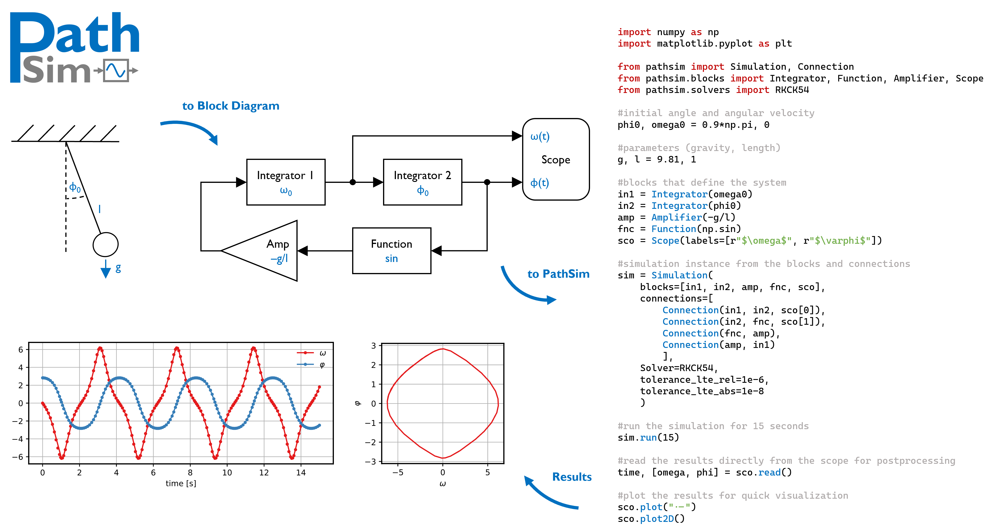

# Summary

PathSim is a flexible, block-based, time-domain dynamical system simulation framework implemented in Python. It enables the modeling and simulation of complex interconnected systems using an object-oriented and decentralized architecture. This architectural choice distinguishes PathSim by distributing state and computation across individual `Block` components, promoting modularity, extensibility, and flexibility. Core components include user-defined or built-in `Block` objects encapsulating specific behaviors, `Connection` objects defining explicit data flow, and a `Simulation` object managing time evolution and coordination. Dynamic blocks possess their own numerical solver instances (`engine`) for state integration. PathSim incorporates advanced features i.e. automatic differentiation for sensitivity analysis or gradient based optimization, discrete event handling for hybrid systems, automatic system- or block-level linearization, hierarchical modeling through subsystems, and a comprehensive suite of ODE solvers suitable for stiff problems. It requires only core scientific Python libraries: NumPy [@harris2020array], SciPy [@virtanen2020scipy], and Matplotlib [@hunter2007matplotlib].

# Statement of Need

Modeling and simulating dynamical systems is vital across many disciplines. PathSim meets the need for a Python-native framework combining a programmatic block-diagram approach with advanced features. Traditional simulation tools often rely on centralized solvers or compiled code, which can limit flexibility and extensibility within the Python ecosystem. PathSim's decentralized architecture offers distinct advantages: enhanced modularity (blocks are self-contained units), easier extensibility (new blocks integrate naturally without core modification), and greater flexibility in model composition and analysis, Cosimulation and Hardware in the Loop (HiL) testing. PathSim specifically addresses:

* **Accessible Hybrid System Simulation:** Integrates event detection (zero-crossing, scheduled) directly into the block-diagram paradigm, simplifying the modeling of systems with both *continuous and discrete dynamics*.
* **Gradient-Enabled Simulation:** Provides built-in *automatic differentiation* for sensitivity analysis and integration with gradient-based optimization or machine learning frameworks.
* **Unified Framework for Diverse Dynamics:** Offers a wide range of solvers, including implicit methods (ESDIRK, BDF/GEAR) for *stiff systems*.
* **Extensibility in Python:** Leverages the scientific Python ecosystem with minimal dependencies. Its architecture allows straightforward creation and integration of custom blocks.

PathSim provides a powerful, flexible, and extensible open-source tool for simulating complex dynamical systems with minimal dependencies in Python.

# Comparison to Existing Tools

Several Python tools exist for simulating dynamical systems. Standard ODE solvers like `scipy.integrate.solve_ivp` [@virtanen2020scipy] offer robust integration but lack a structured framework for modeling complex, interconnected systems or handling discrete events natively. The *Python Control Systems Library* [@pythoncontrol] is a popular package for modeling and optimizing dynamical systems from the control engineering perspective primarily. Libraries like `SimuPy` [@Margolis2017; @SimuPyRepo] provide a block-based modeling approach similar to PathSim, leveraging SymPy for symbolic definition and SciPy solvers for integration. Other frameworks like `Collimator` [@pycollimator] offer graphical interfaces and JAX-based acceleration but require compilation and introduce dependencies beyond the standard scientific Python stack. `bdsim` [@bdsimRepo] also provides block diagram simulation, focusing on robotics. 

PathSim differentiates itself by offering a purely script-based block-diagram interface with a *decentralized architecture*, native integration of both *automatic differentiation* and *discrete event handling*, and a *built-in library* of independently implemented and verified ODE solvers (beyond wrapping SciPy), all while maintaining *minimal core dependencies*.

# Architecture and Design

PathSim employs a decentralized, object-oriented design centered around three primary components:

1.  **Blocks (`Block`):** Represent individual system components or operations. They encapsulate their parameters and, if stateful (like `Integrator` or `ODE`), manage their own internal state via a dedicated numerical integration engine (`engine`) instance. This contrasts with centralized approaches where a single solver manages all system states. Blocks define `update` methods for algebraic computations within a timestep and `step`/`solve` methods for interacting with their `engine` for state evolution.
2.  **Connections (`Connection`):** Define the explicit data flow pathways between block output ports and input ports, mirroring the connections in a block diagram.
3.  **Simulation (`Simulation`):** Coordinates the overall simulation process. It maintains the list of blocks and connections. During each time step, it manages a fixed-point iteration loop. In this loop, `Connection.update()` propagates output values to inputs, and `Block.update()` computes algebraic outputs based on current inputs and states. This iterative process resolves algebraic loops and ensures consistency across interconnected blocks. The `Simulation` object then triggers the `step` (for explicit solvers) or `solve` (for implicit solvers) methods of the blocks' engines to advance their internal states. It also manages the event handling system.

The decentralized design promotes modularity, as blocks are fully self-contained. It simplifies adding new block types without altering the core simulation loop and provides flexibility in configuring individual block behaviors. Additionaly this opens up integration with other simulation environments (co-simulation), or hardware in the loop (HiL) setups through encapsulation within blocks.

# PathSim Modeling Flow

The figure below shows the modeling and simulation flow with PathSim. Once the dynamical system is translated to the block-diagram paradigm, it can be built from PathSim blocks and connections. The code to the right shows block instantiation, connection definition, simulation setup (including solver and tolerance selection), execution, and result visualization.

 

# References

